# Background Root Scan Lifecycle Diagrams

Status: ratified target architecture, implementation frontier open
Owner: library boundary / local library substrate
Scope: background source scan lifecycle, cursor event stream, scoped snapshot invalidation, renderer recovery,
cancellation, and authority flow

---

## Implementation frontier

Current code implements `StartRootScan`, `ReadAfter`, `SourceScanStarted`, `SourceScanProgressed`,
`SourceScanCompleted`, `SourceScanFailed`, and `SourceScanBlocked`.

Cooperative root scan cancellation is implemented. `CancelRootScan` returns `accepted` for active
scans and the scan worker observes the cancellation token at safe work-unit boundaries. The service
emits `SourceScanCancelled` as a terminal event after observed cancellation. `SourceScanCompleted`
is not published after `SourceScanCancelled` for the same `scanRunId`.

Partial scan counters in `SourceScanCancelled` are approximate (driven by committed chunk count);
precise cumulative counters during cancellation are a future refinement.

Active `CancelRootScan` returns one of `accepted`, `notFound`, or `alreadyTerminal`. `notCancelable`
is reserved for a genuinely non-cancellable scan phase and is no longer the permanent default.

Current code does not yet implement `GetBoundaryEventCursor`, `eventStreamEpoch`, `WaitForEventsAfter`,
a Main-owned event pump, `bootstrapPrepared`, finer invalidation scopes, or a full bounded scan
worker pool. The renderer polls `ReadAfter` directly.

`CancelRootScan` is wired through the desktop Main IPC boundary and exposed as a typed renderer API
method. The desktop boundary cancellation path has a real vertical proof against the Rust service
(`apps/desktop/tests/integration/main/rootScanCancelReal.test.ts`): it starts a real stdio
transport, registers a large root, starts a scan, cancels through `cancelRootScanThroughHost`,
observes `accepted` from the command result, reads events through the existing `ReadAfter` path,
and verifies `SourceScanCancelled` with `phase: interrupted` is published while
`SourceScanCompleted` is not. No user-facing cancel UI exists in this pass.

These are ratified target concepts, not accidental names. This document defines the target
architecture. Implementation must close gaps deliberately.

---

These diagrams define the target flow for the background root scan implementation slice.

They are not UI polish diagrams. They are boundary and lifecycle diagrams. The core law is:

> No client bypasses the Rust service, and no renderer invents scan truth.

---

## 1. User starts or attaches to a background scan

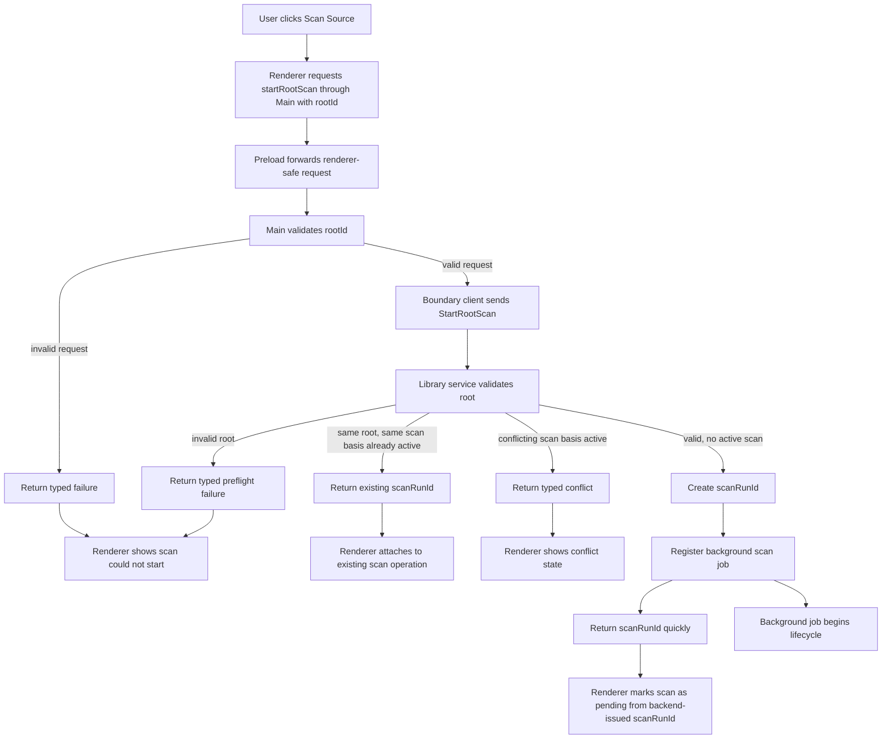

---

## 2. Background scan job lifecycle with batch commits

Work-unit loop internals are expanded in Diagram 3.

Incremental scoped invalidations are produced from committed batches and published within the freshness budget
throughout the work-unit loop. The terminal
reconciliation invalidation shown here is a final consistency signal, not the first visibility trigger. An
implementation that emits only this terminal invalidation has regressed to the pre-incremental model.

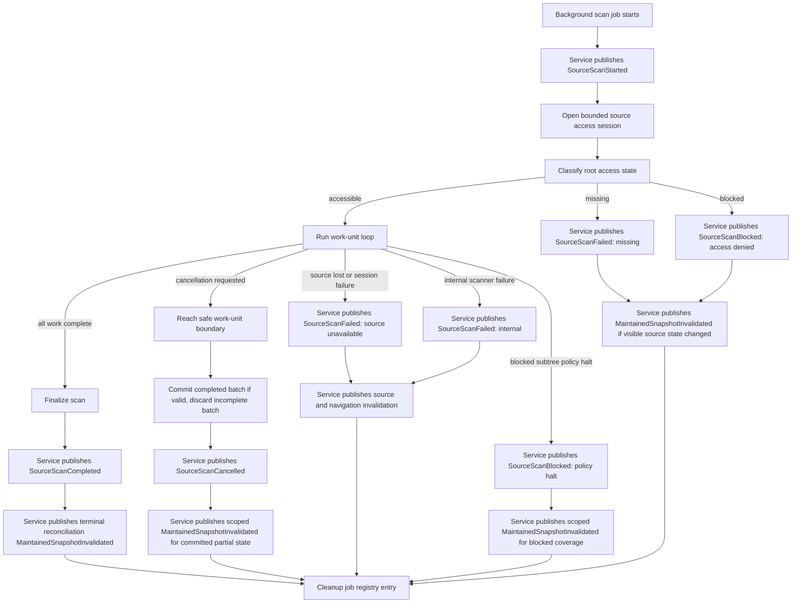

---

## 3. Work-unit loop with progress, failure, and cancellation

`SourceScanProgressed` is coalesced: emitted after committed work batches on a time budget. Work units target short
wall-clock slices, not large fixed file batches. Cancellation is observed at every boundary.
`MaintainedSnapshotInvalidated` is not dropped until terminal completion, but the service may coalesce repeated
invalidations for the same scope within a bounded freshness window. Progress carries monotonic observed counters only.
Percentage is not reported unless a known total work denominator exists.

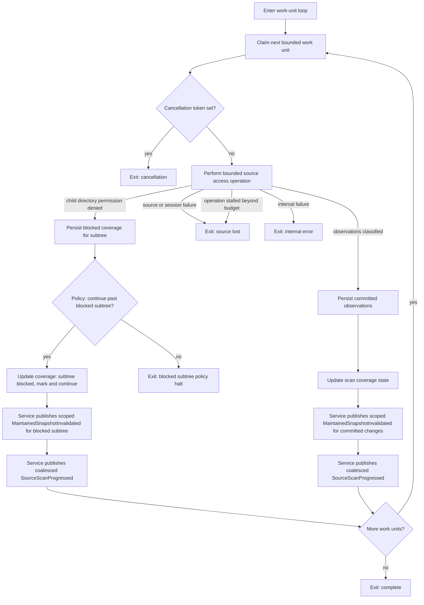

---

## 4. Incremental maintained snapshot invalidation

Each committed work batch, persisted blocked subtree, and terminal scan state change produces invalidation facts for
affected scopes. The service publishes those facts immediately or coalesces repeated facts for the same scope within a
bounded freshness window. It must not collapse scan visibility to terminal-only invalidation. Renderers refresh only
loaded, visible, or selected surfaces. They never refresh the full library hierarchy by default.

Invalidation scope labels in this document are intended protocol-level scope names for the background scan slice. If
current code uses coarser maintained snapshot scopes, the implementation must either add these scopes or map to the
nearest safe current scope without widening renderer authority.

`ContentsScope scopeId` is a boundary-defined contents scope identity. It is not a renderer-local component id or
cache key; wiring invalidation to a renderer-local id will produce incorrect invalidation fan-out.

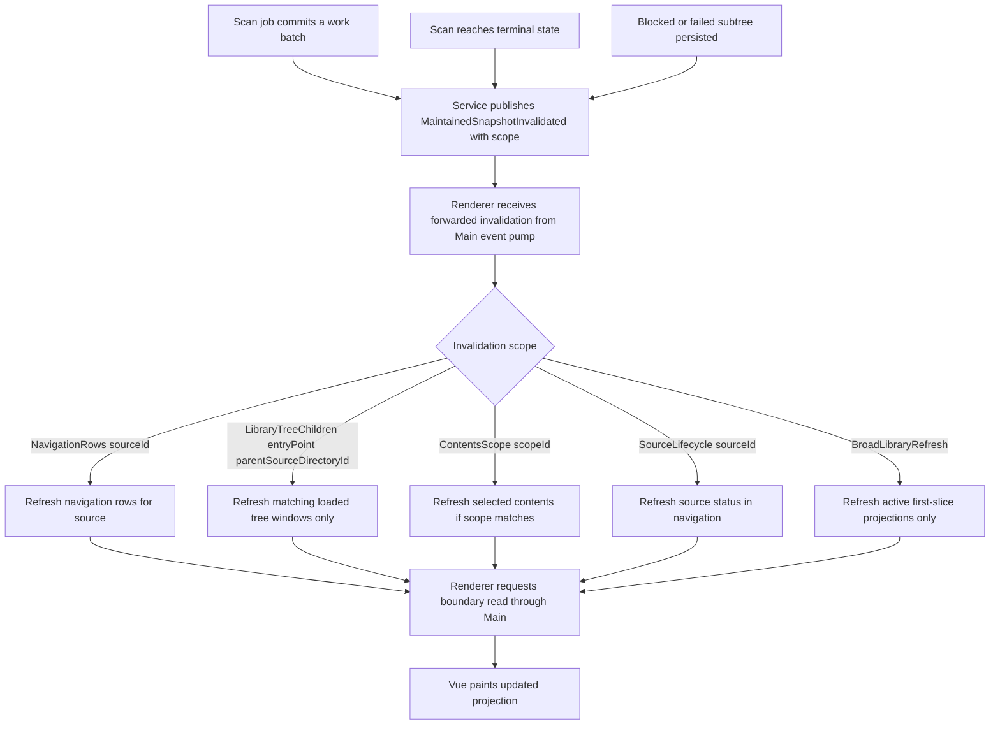

---

## 5. Main-owned event pump and renderer event consumption

Startup uses Diagram 6. Main captures the event cursor on the renderer's behalf and stores it internally; the renderer
performs authoritative reads, then subscribes to Main for forwarded events. Main owns the event poll loop. First-slice
implementation uses bounded `ReadAfter`;
`WaitForEventsAfter` is a future transport upgrade path, not a first-slice requirement. Main maintains one bounded event
pump per library service session, shared across all renderer subscribers; it is not created per Vue component. The
renderer does not poll.

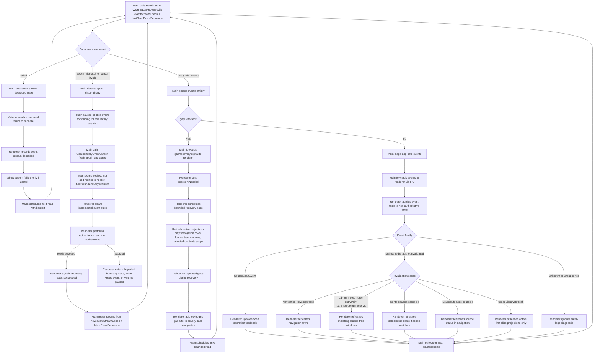

---

## 6. Renderer startup and event cursor bootstrap

Events are not initial state. The renderer requests an event subscription bootstrap from Main. Main calls
`GetBoundaryEventCursor` and stores `eventStreamEpoch + latestEventSequence` internally for the library service
session. Main returns a bootstrap-prepared result to the renderer — not the raw cursor. The renderer then reads
authoritative snapshots through Main, then subscribes to Main for app-safe forwarded events. Main starts the shared
event pump from its stored cursor. The renderer never receives or stores event cursor values.

`GetBoundaryEventCursor` is called by Main, not the renderer directly. It returns `eventStreamEpoch`,
`latestEventSequence`, and `earliestRetainedSequence`. If authoritative reads fail during bootstrap, Main must not start
the event pump and the
renderer must not enter incremental event consumption as if bootstrap succeeded. Do not use `ReadAfter(null)` as a
proxy for tail initialization unless the protocol explicitly defines `null` as tail.

```mermaid
flowchart TD
  A["Renderer library surface starts"] --> B["Renderer requests event subscription bootstrap from Main"]
  B --> C["Main calls GetBoundaryEventCursor"]
  C --> D["Main receives eventStreamEpoch, latestEventSequence, and earliestRetainedSequence"]
  D --> E["Main stores bootstrap cursor internally for the library service session"]
  E --> E2["Main returns bootstrapPrepared to renderer"]
  E2 --> F["Renderer requests authoritative navigation rows through Main"]
  F --> G["Renderer requests active library tree windows through Main"]
  G --> H["Renderer requests selected contents scope through Main if selection exists"]
  H --> I{"Authoritative reads successful?"}
  I -->|" no "| J["Bootstrap failed: renderer stays in degraded state, Main does not start event pump"]
  I -->|" yes "| K["Renderer subscribes to app-safe library events from Main"]
  K --> L["Main Boundary Event Pump starts from stored bootstrap cursor"]
  L --> M["Normal event handling continues via Diagram 5"]
```

---

## 7. End-to-end first-slice flow with progressive scan visibility

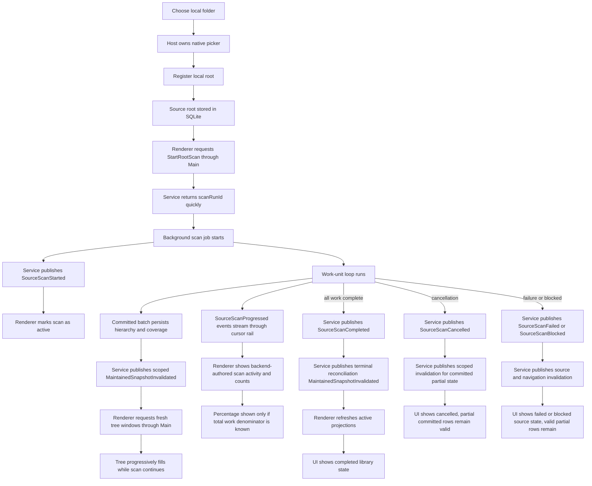

---

## 8. Root validation, blocked states, cancellation, and mid-scan failure

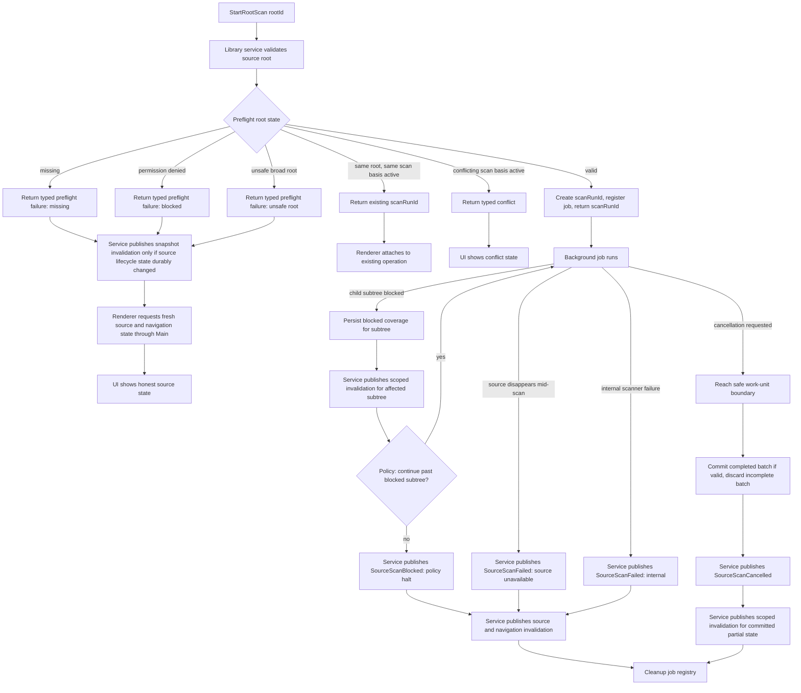

---

## 9. Cancel scan flow

`CancelRootScan` acknowledges that cancellation was requested. It does not wait for the job to reach the terminal
cancelled state. `SourceScanCancelled` is the terminal event that confirms the job actually stopped.

`CancelRootScan` returns one of four typed results: `accepted`, `notFound`, `alreadyTerminal`, or `notCancelable`.
These are distinct renderer states and must not be collapsed into a generic not-active result.

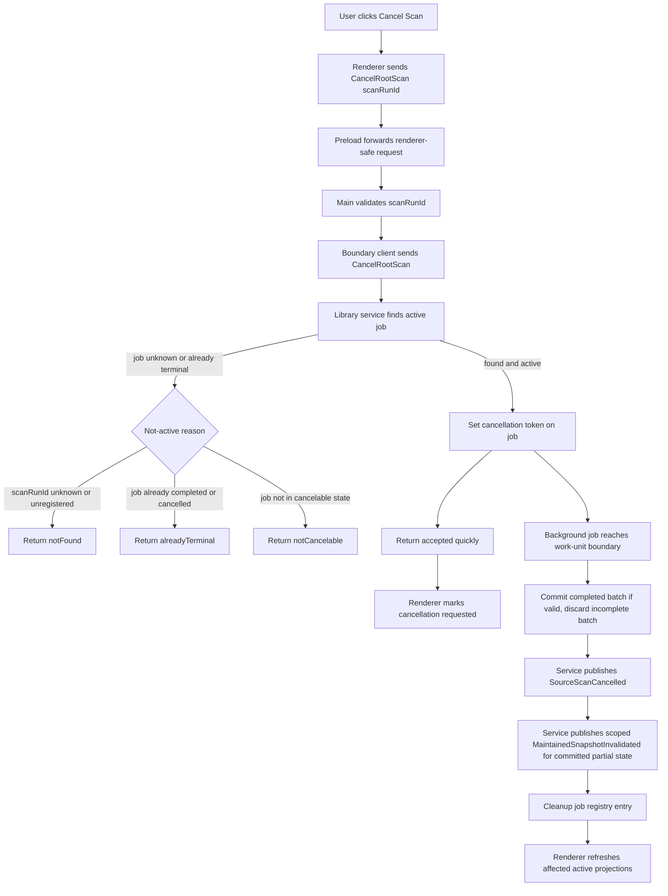

---

## 10. Authority map for scan commands, events, reads, and cancellation

```mermaid
flowchart LR
  Renderer["Renderer"] -->|" start scan intent: startRootScan rootId "| MainPreload["Main/Preload"]
  Renderer -->|" cancel scan intent: cancelRootScan scanRunId "| MainPreload
  MainPreload -->|" validated command "| BoundaryClient["Boundary Client"]
  BoundaryClient -->|" StartRootScan, CancelRootScan, readLibraryTreeChildren, contents reads "| RustService["Rust Library Service"]
  RustService -->|" readLibraryTreeChildren, contents reads "| SQLite["SQLite Store"]
  RustService -->|" own job registry and supervisor "| ScanJobReg["Scan Job Registry"]
  ScanJobReg -->|" track operation budget, worker lease, cancellation state "| ScanSupervisor["Scan Job Supervisor"]
  ScanSupervisor -->|" dispatch bounded work units "| BoundedWorker["Bounded Scan Worker Pool"]
  BoundedWorker -->|" persist observations and coverage "| SQLite
  BoundedWorker -->|" scan lifecycle observations and progress counters "| ScanSupervisor
  ScanSupervisor -->|" lifecycle transitions and source session outcomes "| RustService
  RustService -->|" SourceScanEvent and MaintainedSnapshotInvalidated "| EventStream["Boundary Event Stream"]
  EventStream -->|" ReadAfter or WaitForEventsAfter "| MainEventPump["Main Boundary Event Pump"]
  MainEventPump -->|" app-safe forwarded events via IPC "| RendererEventConsumer["Renderer Library Event Consumer"]
  RendererEventConsumer -->|" non-authoritative progress state "| OpFeedback["Operation Feedback"]
  RendererEventConsumer -->|" snapshot invalidation "| ScopedRereads["Scoped Authoritative Rereads"]
  ScopedRereads -->|" fresh snapshot requests "| MainPreload
```

---

## Governing law

> **No client bypasses the Rust service, and no renderer invents scan truth.**

> **Events are not initial state.** Main captures an event cursor on the renderer's behalf, the renderer reads
> authoritative snapshots, then consumes events after that cursor via Main for incremental updates only.

> **Snapshot invalidation is scoped and freshness-bounded.** Committed scan batches produce invalidation facts for
> affected scopes. The service may coalesce repeated invalidations for the same scope within a bounded freshness window,
> but must not collapse scan visibility to terminal-only invalidation. Renderers refresh only loaded, visible, or
> selected surfaces — never the full library hierarchy.

> **Progress is coalesced.** `SourceScanProgressed` is emitted after committed work batches on a time budget.
> Progress carries monotonic observed counters. Percentage is not reported unless the scan basis has a known total
> work denominator.

> **Cancellation is a first-class terminal state.** `SourceScanCancelled` is published on the event rail. Committed
> partial results remain valid and browseable.

> **Cancel request is not cancellation completion.** `CancelRootScan` acknowledges that cancellation was requested.
> `SourceScanCancelled` is the terminal event that confirms the job actually stopped.

> **Cancellation results are typed.** `CancelRootScan` returns one of: `accepted` if the cancellation token was set;
> `notFound` if the `scanRunId` is unknown or unregistered; `alreadyTerminal` if the job has already completed or been
> cancelled; `notCancelable` if the job exists but cannot be cancelled in its current state. These are distinct renderer
> outcomes and must not be collapsed into a generic not-active result.

> **Already-running is not an error.** Same root with same scan basis returns the existing `scanRunId`. A conflicting
> scan basis returns a typed conflict, not a failure.

> **Scan basis** is the identity of the requested scan work: `rootId` plus scan policy/admission version and any
> explicit scan options. In first slice, scan basis is effectively `rootId` plus current scan policy version.
> Already-running is not an error only when the new request matches the active basis exactly. A differing basis returns
> a
> typed conflict.

> **Start failure is not scan failure.** If `StartRootScan` rejects before a `scanRunId` is created, the caller receives
> a typed command failure. `SourceScanFailed`, `SourceScanBlocked`, and `SourceScanCancelled` are terminal events only
> for
> an accepted scan run. Preflight failures do not emit scan terminal events; they may emit scoped snapshot invalidation
> only if source lifecycle state was durably updated.

> **Source disappearance is not access denial.** `SourceScanBlocked` applies to policy-driven permission and admission
> failures. Source disappearance mid-scan — drive ejected, network volume lost — is
> `SourceScanFailed: source unavailable`, or a future `SourceScanUnavailable` event when that distinction warrants a
> dedicated type.

> **Event cursor bootstrap requires an explicit protocol operation.** Main calls `GetBoundaryEventCursor`, which
> returns `eventStreamEpoch`, `latestEventSequence`, and `earliestRetainedSequence`. Main stores the bootstrap cursor
> internally for the library service session and returns a bootstrap-prepared result to the renderer. The renderer does
> not receive or hold the raw cursor. Authoritative reads complete before the renderer subscribes to Main's event pump.
> Main starts the event pump from the stored cursor. `ReadAfter(null)` meaning tail is not acceptable without explicit
> protocol support for that semantics.

> **Bootstrap cursor is session-event position, not state freshness.** Events after the bootstrap cursor are replayed
> after authoritative reads complete. Events before or at the cursor are covered by those reads. If authoritative reads
> fail during bootstrap, Main must not start the event pump and the renderer must not enter incremental event
> consumption as if bootstrap succeeded.

> **Epoch recovery uses the same cursor-first bootstrap discipline as startup.** Main must not resume normal event
> forwarding from a fresh epoch until the renderer has completed authoritative recovery reads successfully. If recovery
> reads fail, the renderer enters an explicit degraded bootstrap state and Main keeps normal event forwarding paused for
> that library session. The recovery sequence is: Main pauses forwarding, calls `GetBoundaryEventCursor`, stores the
> fresh cursor internally, notifies the renderer that bootstrap recovery is required, renderer clears incremental state
> and performs authoritative reads, and only then does Main restart the pump from the stored fresh cursor. The renderer
> does not receive the raw cursor at any point during epoch recovery.

> **Event cursors are scoped to an event stream epoch.** `GetBoundaryEventCursor` returns `eventStreamEpoch`,
> `latestEventSequence`, and `earliestRetainedSequence`. `ReadAfter` includes the epoch with the cursor. If the epoch
> does not match the current event stream — for example after a Rust service restart that resets sequence numbers —
> Main treats the cursor as invalid, calls `GetBoundaryEventCursor` to obtain a fresh epoch and cursor, stores it
> internally, notifies the renderer that bootstrap recovery is required, and restarts the pump from the new epoch only
> after authoritative recovery reads succeed. Event sequence numbers are
> meaningful only inside their event stream epoch. An orphaned sequence number from a prior epoch must not be presented
> to a new stream.

> **All boundary events are emitted by the Rust Library Service.** Workers report scan lifecycle observations and
> progress counters to the scan job supervisor and registry. The Rust Library Service is the sole publisher of
> `SourceScanEvent` and `MaintainedSnapshotInvalidated` to the boundary event stream. Workers are not independent
> boundary event publishers.

> **Scan events may arrive before command reply state is observed.** Renderer scan operation state is keyed by
> backend-issued `scanRunId`. A scan event may create or update the local operation entry even if the `StartRootScan`
> command reply has not yet been observed.

> **Event delivery is bounded.** Main owns the `ReadAfter` poll loop with small payloads, coalesced scan progress,
> and backoff on failure. Main forwards app-safe events to the renderer via IPC. The renderer does not own a poll loop
> against the Rust boundary. Shared-memory event delivery is a future hot-lane optimization and is not required for
> background library scan correctness.

> **The desktop main process owns event pumping.** The renderer subscribes to app-safe library boundary events from
> Main. The renderer does not own a polling loop against the Rust boundary. First-slice delivery may use bounded
> `ReadAfter` polling inside Main; a future `WaitForEventsAfter` or shared-memory transport may replace that without
> changing renderer authority. The canonical spine is: Rust publishes. Main pumps. Renderer subscribes.

> **Main event pump is shared and subscription-scoped.** Main owns one bounded event pump per library service session,
> not per Vue component or per renderer surface. Renderer surfaces subscribe and unsubscribe to app-safe forwarded
> events. Main starts the pump when at least one library subscriber exists and stops or idles it when none remain.
> Implementations must not create a pump instance per component; doing so would produce multiple concurrent poll loops
> against the same event stream.

> **Events carry summaries, not rows.** Scan progress events carry small counters and identifiers. Snapshot invalidation
> carries scope identity. Rows are fetched through authoritative reads and are never embedded in scan events.

> **Gap recovery is bounded and debounced.** A gap triggers recovery of active projections only: navigation rows, loaded
> tree windows, selected contents scope, and visible source lifecycle state. Repeated gaps coalesce into one recovery
> pass. Recovery work is lower priority than direct user interaction and live-performance-critical work.

> **Discovery progress is indeterminate until a denominator is known.** `SourceScanProgressed` may report monotonic
> observed counters such as directories visited, files observed, and rows committed. It must not report a percentage
> unless the scan basis has a known total work denominator.

> **Work-unit boundaries are time-budgeted.** Scan work units target short wall-clock slices, not large fixed file
> batches. Cancellation is observed at every boundary. The system favors discarding a small incomplete batch immediately
> over making the user wait for a large batch to commit.

> **Source I/O must not pin service responsiveness.** Filesystem access for scans runs in bounded scan workers with
> limited concurrency, cooperative cancellation checks, and operation budgets. If a source access operation stalls
> beyond the scan policy budget, the scan marks the source or session as unavailable, stops scheduling new work for that
> source, preserves committed observations, and publishes terminal state. The service command path and event stream must
> remain responsive. If an OS call hangs inside a worker thread and cannot be recovered at the syscall level, isolation
> ensures the service is not pinned.

> **Scan workers are bounded.** The Rust Library Service owns a Scan Job Registry. Workers execute bounded work units
> with cooperative cancellation. SQLite receives committed observations only from completed work units. Scan worker
> concurrency is bounded by service policy.

> **Stalled worker leases are isolated.** If a worker exceeds the operation budget and does not return, the supervisor
> retires or quarantines that worker lease for the active scan run. The bounded worker pool must not spawn unbounded
> replacements for quarantined slots; pool capacity must account for stalled workers. A late worker result is discarded
> unless it matches the active scan run and epoch. Ghost drives cannot exhaust the worker pool.

> **`ContentsScope scopeId` is a boundary-defined identity.** It is not a renderer-local component id or session-local
> cache key. Wiring invalidation to a renderer-local id will produce incorrect invalidation fan-out. The boundary
> service defines the scope; the renderer consumes it.

> **Background scan jobs are runtime state in the first slice.** After service restart, no scan job is resumed
> automatically unless a future durable scan-run ledger exists. Persisted hierarchy and coverage rows remain
> authoritative. Renderer startup performs authoritative reads and does not assume prior scan jobs are still active.

> **Warm events are not resource transport.** Scan events and invalidations carry small summaries and scope identifiers
> only. Large payloads — audio bytes, artwork, waveform data, and future media resources — use the resource lane with
> handles and ranged reads, not the event stream. Embedding large payloads in scan events or invalidation facts is
> prohibited.

---

## 11. Source I/O budget and ghost-drive protection

The scan job supervisor owns the operation budget clock for each in-flight work unit. If a worker does not return
within budget, the supervisor — not the worker — classifies the source or session as unavailable and stops scheduling
new work for that source. The supervisor then retires or quarantines the stalled worker lease for the active scan run;
the bounded worker pool does not spawn unbounded replacements for quarantined slots — pool capacity accounts for stalled
workers. If a stalled worker returns late, the supervisor validates the result against the active `scanRunId` and job
epoch before any commit; a stale result is discarded and cannot mutate current scan state. Note: if an OS call truly
hangs at the syscall level, it may not be recoverable in-thread. Worker isolation ensures this does not pin the service
command path or event stream.

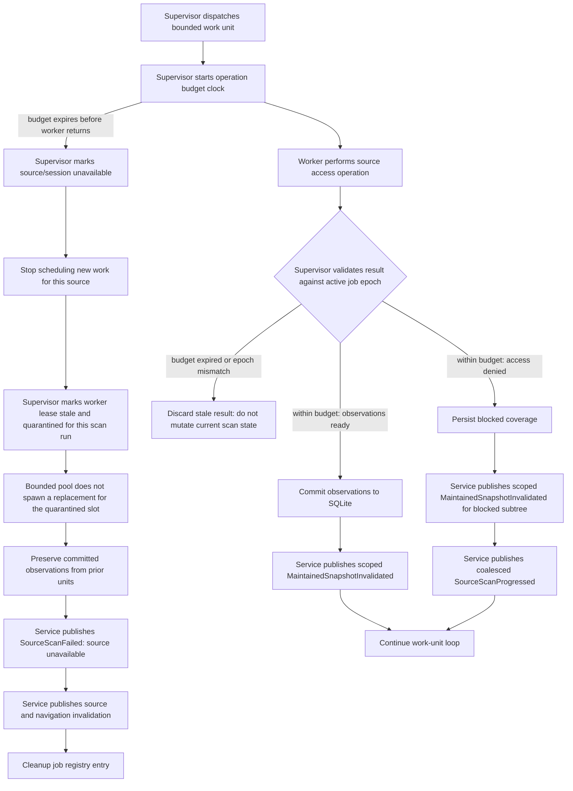

---

## 12. Progress state model: indeterminate discovery to terminal summary

Percentage is not a valid output during raw discovery because the denominator does not exist yet. The renderer must
natively support an indeterminate discovery state and display observed counters rather than fabricating completion
fractions. Transition to deterministic numeric progress is conditional and explicit.

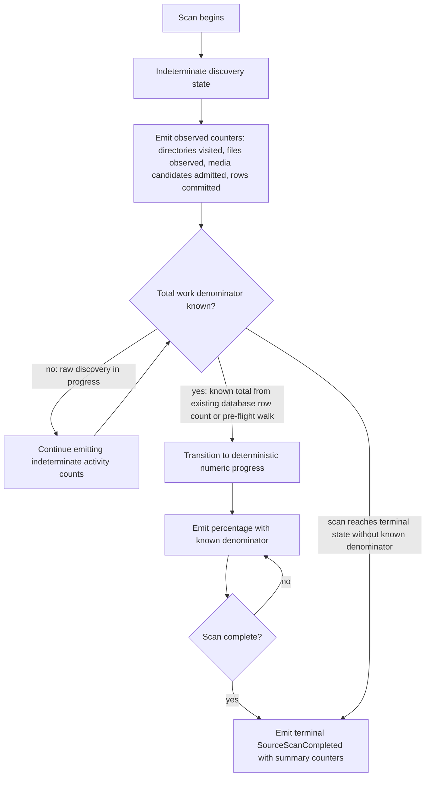
