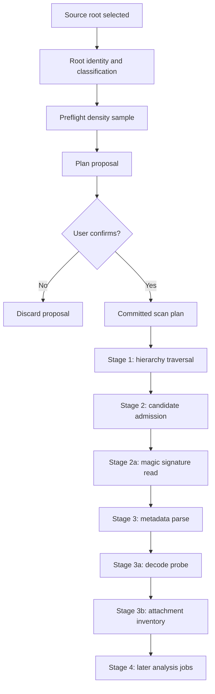
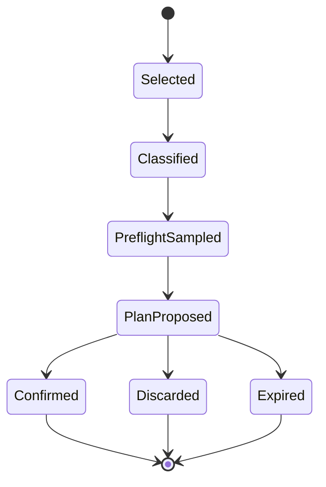
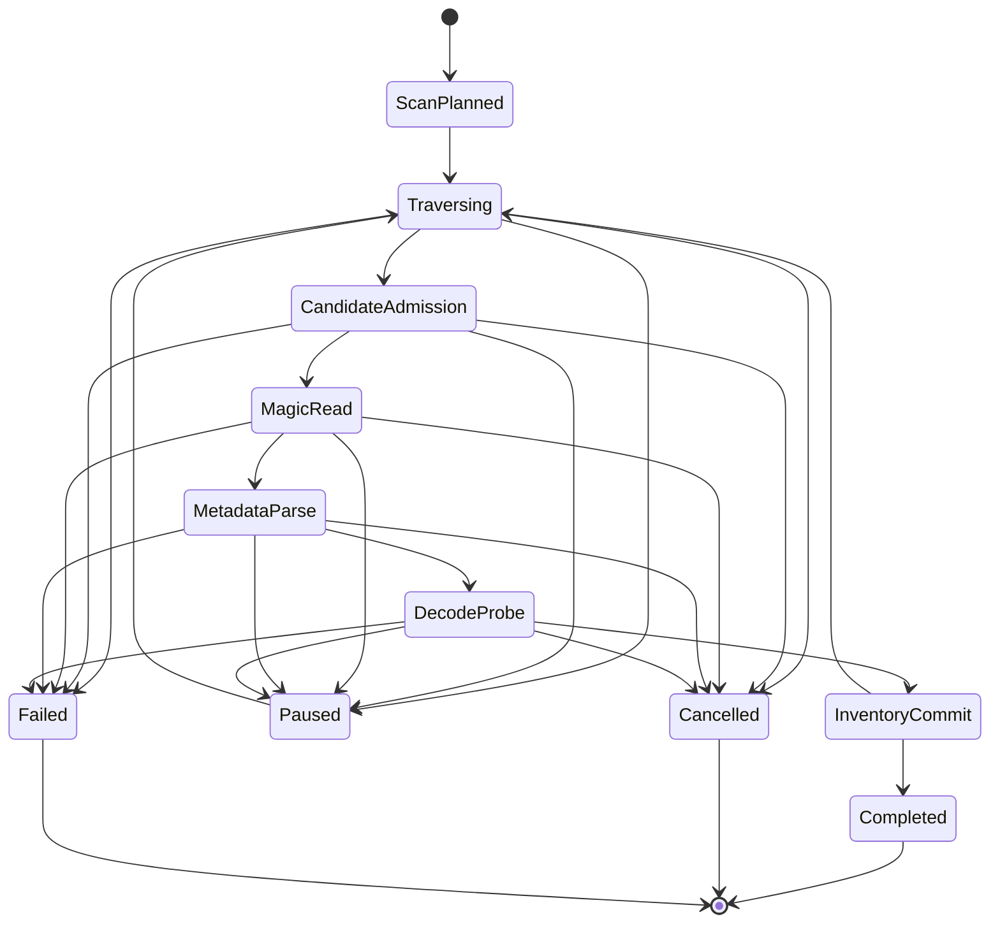

# Source Root Scan Admission Contract

## Implementation status note

This contract defines the desired scan architecture. The following are not yet fully implemented
and must not be presented as current implementation reality:

| Aspect                                 | Current state                                                                                                                                                                                                                          |
| -------------------------------------- | -------------------------------------------------------------------------------------------------------------------------------------------------------------------------------------------------------------------------------------- |
| Source root classification             | Defined in contract; partial implementation. Classification into `system_volume_root`, `broad_drive_root`, etc. is not yet applied before traversal.                                                                                   |
| Density sampling / preflight           | Not yet implemented. Current `runRootScan` begins traversal without prior density sampling.                                                                                                                                            |
| Scan plan model                        | Desired architecture. Current implementation has no formal scan plan stage.                                                                                                                                                            |
| Work budget per scan unit              | Desired architecture. Current implementation lacks bounded work units with yield points.                                                                                                                                               |
| Magic signature reads                  | Not yet implemented. No 8–16 byte signature read exists before inspection work queueing.                                                                                                                                               |
| Candidate admission gating persistence | Desired architecture. Current implementation persists `source_files` before candidate admission.                                                                                                                                       |
| Background scan jobs                   | **Next implementation frontier.** Current `runRootScan` is synchronous and runs on the blocking command path. Background scan job lifecycle (non-blocking `StartRootScan` → progress events → terminal events) is not yet implemented. |

The contract's product ambition remains authoritative. Implementation must not water down
the ambition. Each future implementation slice should move closer to the full contract,
not replace it with a minimal interpretation.

## Current Arc A admission law

Source registration is an admission boundary, not a promise to create a source row.

Arc A implements source registration proposals and broad-root admission guards only. Arc A does not implement density
sampling, scan-plan confirmation, `ConfirmSourceRegistrationProposal`, or any equivalent confirmation command.

Broad/system/risky root selection creates a registration proposal, not a source root. This includes system-volume
roots, broad drive roots, user-profile roots, network/cloud roots when cheaply detectable, indirection roots, and
unknown risky roots. Source root creation happens only after admission. Arc A creates proposals but intentionally
provides no confirmation command or conversion path from proposal to source. Arc A provides no path that converts a
broad/system proposal into a source root.

Protected root selection is rejected, not negotiated. Protected/system-owned locations such as Windows, Program Files,
ProgramData, System Volume Information, Recovery, WindowsApps, and equivalent cheaply detectable locations must not be
stored as proposals or sources. In Arc A, `protectedRoot` is rejected: it must not return `proposalRequired`, must not
create a source row, and must not create a proposed proposal row. Arc A does not store rejected protected-root attempts.
Arc A does not implement limited protected-root scanning.

Registration proposals are distinct from sources. They are not scannable, are not returned by local-root reads, do not
create source lifecycle/navigation/browser/scan/maintenance state, and are idempotent by canonical path while their
status is proposed.

`StartRootScan` is only for admitted source roots. It must defensively reject broad/system/risky/protected roots even if
a legacy or manually inserted source row points at such a path, because those roots lack confirmed scan-plan admission.
Density preflight, scan-plan confirmation, limited protected-root scanning, and broad scan execution are later arcs.

## Core law

A library scan is not a forensic search of every byte on disk. It is a policy-governed source traversal that admits
media candidates, records exclusions, and escalates only plausible media into deeper inspection.

This contract exists because users will select broad, ugly roots: system drives, external drives, NAS shares, cloud
folders, home directories, backup disks, and folders containing years of non-music debris.

Dekzer must handle those selections without freezing, silently lying, corrupting source state, or turning the database
into a landfill.

## Product promise

When a user selects a source root, Dekzer must be able to say:

> I know what you asked me to inspect. I know whether that place is narrow, broad, remote, protected, cloud-backed, or
> system-owned. I know what I will scan, what I will skip, what I could not access, and what I found. I will not pretend
> ignored territory was inspected.

## Scope

This document governs the first substrate path from root selection to media attachment inventory.

It covers:

| Area                       | Included                                                                                            |
| -------------------------- | --------------------------------------------------------------------------------------------------- |
| Source root selection      | User-selected folders, drives, shares, cloud roots, and indirection paths.                          |
| Source root classification | Normal, broad, system, user profile, network, cloud-backed, protected, and unknown roots.           |
| Source root identity       | Durable identity where possible, path as current resolution claim.                                  |
| Broad-root preflight       | Cheap music-density sampling before committing to traversal.                                        |
| Scan plans                 | Explicit traversal, exclusion, candidate, magic-read, observation, cancellation, and resume policy. |
| Work budgeting             | Bounded progress units instead of hard depth/count limits as the primary safety model.              |
| Candidate admission        | Extension/path/proximity policy before any byte read.                                               |
| Magic signature reads      | Tiny 8 to 16 byte reads for admitted candidates only, with MP3 false-positive rules.                |
| Attachment inventory       | Metadata parse and decode probe before readable media attachment authority.                         |
| Observations               | Skipped, inaccessible, ignored, rejected, unsupported, candidate, and inventory evidence.           |

## Non-goals

The first slice does not implement full forensic recovery, complete audio analysis, controller compatibility, deck
runtime, full CUE segmentation semantics, or deep import of arbitrary binary data.

The first slice must not choose names, tables, APIs, or job behavior that make those later capabilities impossible.

## Required concepts

| Concept                      | Meaning                                                                                              |
| ---------------------------- | ---------------------------------------------------------------------------------------------------- |
| Source root                  | User-declared location Dekzer is allowed to inspect.                                                 |
| Root resolution              | Current path, mount, or provider route through which the source root is reachable.                   |
| Root identity                | Durable identity of the selected root, independent of current path where possible.                   |
| Registration proposal        | Durable setup record created while a broad root awaits confirmation. Not an active source root.      |
| Scan preflight               | Cheap classification and sampling before a real traversal plan is committed.                         |
| Music-density sample         | Bounded BFS directory sample that counts likely media candidates without byte reads.                 |
| Scan plan                    | Bounded policy describing what traversal will do, skip, sample, and escalate.                        |
| Work unit                    | Bounded slice of scan work after which the job yields observations and accepts cancellation.         |
| Traversal observation        | Evidence produced while walking directories, without reading media bytes.                            |
| Candidate admission          | Decision that a file is plausible enough to inspect as media or companion metadata.                  |
| Extension-admitted candidate | Scan admission observation: path/extension policy admitted the file for cheap inspection.            |
| Magic signature read         | Tiny byte read, normally 8 to 16 bytes, used to detect obvious container signatures.                 |
| Format evidence grade        | Doctrine evidence grade such as declared, detected, computed, verified, tested, exported, confirmed. |
| Attachment inventory         | Readable media objects admitted into the library substrate.                                          |
| Companion artifact           | Non-audio artifact associated with media, such as CUE sheets, playlists, or sleeve candidates.       |

## Vocabulary separation

Candidate admission observations and doctrine evidence grades must not share names unless they describe the same concept.

The most important separation:

| Layer          | Term               | Meaning                                                                                |
| -------------- | ------------------ | -------------------------------------------------------------------------------------- |
| Scan admission | extension_admitted | The scan policy admitted a file because its path or extension is plausible.            |
| Evidence grade | declared           | A format declaration exists, usually extension, container claim, or external metadata. |
| Evidence grade | detected           | Bytes or parser evidence indicate a container or media family.                         |

A file named `song.mp3` may have both:

| Observation              | Meaning                                             |
| ------------------------ | --------------------------------------------------- |
| extension_admitted       | The scanner is allowed to perform cheap inspection. |
| declared format evidence | The extension declares MP3.                         |

Those observations belong to different layers. Code must not collapse them into one field, enum, table, or status.

## Root identity law

A source root is not identified by path alone.

Paths are current resolution claims. They may change without the underlying source changing.

Examples:

| Case                                        | Problem with path-only identity        | Required behavior                                                           |
| ------------------------------------------- | -------------------------------------- | --------------------------------------------------------------------------- |
| USB drive was E:\ and reappears as F:\      | Same drive appears to be a new source. | Detect same volume identity and surface relocation.                         |
| NAS share remounts through a different path | Same source gets duplicated.           | Prefer stable share identity where available.                               |
| Folder renamed or moved within same volume  | Same source becomes missing.           | Prefer directory file identity when available.                              |
| Cloud folder changes local mount path       | Durable source becomes path-fragile.   | Store provider/root identity when available, with path as resolution claim. |

### Platform identity sources

| Platform/source type   | Preferred durable identity                                                   | Fallback                                   |
| ---------------------- | ---------------------------------------------------------------------------- | ------------------------------------------ |
| Windows volume root    | Volume GUID path and/or volume serial number with filesystem metadata.       | Current drive path plus user confirmation. |
| Windows directory      | File ID from FileIdInfo or BY_HANDLE_FILE_INFORMATION, plus volume identity. | Canonical path.                            |
| POSIX volume/directory | Device and inode from stat.                                                  | Canonical path.                            |
| Network share          | Server/share identity plus filesystem IDs where available.                   | UNC path with remount detection.           |
| Cloud root             | Provider account/root identifier where available.                            | Local mount path plus provider marker.     |

### Stored root identity shape

| Field                          | Meaning                                                              |
| ------------------------------ | -------------------------------------------------------------------- |
| declared_path                  | Path selected by the user at registration time.                      |
| current_resolved_path          | Path through which the source is currently reachable.                |
| root_identity_kind             | volume, directory, network_share, cloud_root, path_only, unresolved. |
| durable_identity               | Platform-specific stable identity payload, when available.           |
| identity_resolution_confidence | high, medium, low, indeterminate.                                    |
| last_seen_at                   | Last time the source identity was observed.                          |
| relocation_observation         | Optional record when the same identity appears at a new path.        |

A path change is not automatically a new source root. It is a resolution event.

The value `indeterminate` is used for root identity confidence when Dekzer cannot resolve a stable identity. Do not use
`unknown` here, because `unknown` is already a readiness verdict in the doctrine vocabulary.

### Bootstrap and upgrade rule

Early implementation may register source roots with path-only identity while the durable identity resolver is
incomplete.

That is allowed only if the storage shape already has explicit slots for durable identity, identity kind, confidence,
current resolution, and relocation observations.

Implementation steps that use path-only identity are provisional. They must not harden path strings into permanent
source identity.

Relocation detection is not available until durable identity resolution lands. The schema and API must still be shaped
so the upgrade is additive rather than a migration from a false model.

## Root classification

Before scanning, Dekzer classifies the selected root.

| Root class         | Examples                                 | Default behavior                                                                                                         |
| ------------------ | ---------------------------------------- | ------------------------------------------------------------------------------------------------------------------------ |
| normal_music_root  | D:\Music, ~/Music/DJ                     | Allow normal scan plan.                                                                                                  |
| broad_drive_root   | E:\, external disk root                  | Allow broad-root scan plan after summary.                                                                                |
| system_volume_root | C:\                                      | Warn, suggest narrower roots, require explicit confirmation for broad scan.                                              |
| user_profile_root  | C:\Users\Maikel, /home/user              | Warn, suggest Music, Downloads, Desktop, or chosen subfolders.                                                           |
| cloud_backed_root  | OneDrive, Dropbox, iCloud, Google Drive  | Warn about placeholders, hydration, offline behavior, and provider churn.                                                |
| network_root       | NAS, SMB share, mounted share            | Use latency/offline-aware plan.                                                                                          |
| protected_root     | system/protected/inaccessible path       | Arc A: reject. Future limited protected scanning requires a separate contract and must not reuse registration proposals. |
| indirection_root   | shortcut, symlink, junction, mount point | Resolve, classify target, show indirection before scan.                                                                  |
| unknown_root       | identity or access cannot be determined  | Require conservative plan.                                                                                               |

The classification is persisted. It is part of the source root registration record, not a transient UI label.

## Preflight before traversal

Broad roots require preflight before committing to the real scan.

### Music-density sampling

For broad roots, Dekzer performs a cheap breadth-first sample before building the final scan plan.

Rules:

| Rule            | Requirement                                                                       |
| --------------- | --------------------------------------------------------------------------------- |
| Byte reads      | None during density sampling. Directory listing only.                             |
| Depth           | Usually first two visible levels, policy-configurable.                            |
| Work bound      | Stop after a bounded number of directories and entries.                           |
| Candidate basis | Count only files admitted by path/extension/companion policy.                     |
| Output          | Candidate counts and high-density subtrees, plus separate traversal observations. |
| User signal     | Surface early when no likely music appears near the top.                          |
| Priority        | Use density to scan promising subtrees first.                                     |

This is triage before surgery.

If the first sample yields no admitted media or companion candidates, Dekzer should tell the user:

> No music candidates were found near the top of this root. You can continue with a safe broad scan, or choose a
> narrower folder for faster results.

### Density verdicts

Density verdicts describe candidate concentration only. They do not describe access failures or policy exclusions.

| Verdict        | Meaning                                       | Scan-plan effect                  |
| -------------- | --------------------------------------------- | --------------------------------- |
| high_density   | Many admitted candidates relative to entries. | Prioritize subtree.               |
| medium_density | Some admitted candidates.                     | Traverse normally.                |
| low_density    | Few candidates.                               | Deprioritize.                     |
| zero_density   | No admitted candidates in sample.             | Surface warning and deprioritize. |

### Sampling traversal observations

Traversal outcomes discovered during sampling are recorded separately.

| Observation               | Meaning                                                                                    | Scan-plan effect                                              |
| ------------------------- | ------------------------------------------------------------------------------------------ | ------------------------------------------------------------- |
| sampling_inaccessible     | Directory could not be listed.                                                             | Record and continue.                                          |
| sampling_excluded         | Directory skipped by policy.                                                               | Record exclusion, do not traverse.                            |
| sampling_indirection      | Directory is symlink, junction, mount point, shortcut, or provider-specific reparse point. | Apply reparse policy.                                         |
| sampling_budget_exhausted | Sample stopped because work budget ended.                                                  | Preserve partial sample and continue planning conservatively. |

A directory that is inaccessible or excluded has no density verdict. It has a traversal observation.

## Scan plan model

A scan plan is the authoritative traversal contract for a source scan job.

It defines:

| Area                | Required contents                                                   |
| ------------------- | ------------------------------------------------------------------- |
| Root identity       | Which source root and current resolution are being scanned.         |
| Root class          | Classification used to choose policy.                               |
| Density result      | Preflight sample summary and prioritized subtrees.                  |
| Traversal policy    | What directories can be entered.                                    |
| Exclusion policy    | Which path classes are skipped by default.                          |
| Candidate policy    | Which files may become media or companion candidates.               |
| Magic-read policy   | Whether unknown extensions may receive tiny signature reads.        |
| Reparse policy      | How symlinks, junctions, and mount points are handled.              |
| Work budget         | How much work a scan unit may perform before yielding.              |
| Observation policy  | What gets persisted as detailed rows vs aggregate counts.           |
| Cancellation policy | Where cancellation is accepted and how partial state remains valid. |
| Failure policy      | Which unrecoverable conditions fail the job rather than cancel it.  |
| Resume policy       | How the job continues after restart.                                |

A broad source root is not invalid. It requires a scan plan.

## Work budget, not hard structure limits

Dekzer must not rely on hard depth or hard file-count limits as the primary safety model.

Hard depth limits reject legitimate music archives. Hard count limits punish valid large libraries while failing to
distinguish 2,000 FLAC files from 2,000 DLL files.

The primary model is a work budget per scan unit.

| Work-budget property           | Requirement                                                                                        |
| ------------------------------ | -------------------------------------------------------------------------------------------------- |
| Directory entries per unit     | Bounded by policy.                                                                                 |
| Candidate inspections per unit | Bounded separately from directory listing.                                                         |
| Byte reads per unit            | Bounded separately from candidate count.                                                           |
| Metadata parses per unit       | Bounded separately from magic reads.                                                               |
| Yield points                   | After each unit, before descending, before byte reads, before metadata parse, before decode probe. |
| UI progress                    | Published incrementally from observations, not only at completion.                                 |
| Cancellation                   | Accepted at every yield point.                                                                     |
| Partial validity               | Every committed observation must be valid even if the job stops immediately after.                 |

Safety guards may still exist for pathological cases, but they are not the main model for ordinary broad-root safety.

## Staged admission pipeline

Traversal, candidate admission, magic signature reads, metadata parsing, decode probing, attachment inventory, and
analysis are separate stages.

### Stage 1: hierarchy traversal

Stage 1 walks directories under the scan plan.

It does not decode audio. It does not parse metadata. It does not fingerprint files. It does not treat every file as
suspicious media.

Outputs:

| Output                      | Meaning                                                       |
| --------------------------- | ------------------------------------------------------------- |
| hierarchy nodes             | Directories that were traversed or represented.               |
| skipped observations        | Paths skipped by policy.                                      |
| inaccessible observations   | Paths that could not be listed or opened.                     |
| candidate path observations | Files admitted by path/extension/companion policy.            |
| aggregate ignored counts    | Irrelevant files counted without per-file database pollution. |
| density observations        | Candidate distribution by subtree.                            |

### Stage 2: candidate admission

A file becomes a candidate only when policy admits it.

Default candidate classes:

| Candidate class    | Examples                                       | First-slice behavior                            |
| ------------------ | ---------------------------------------------- | ----------------------------------------------- |
| primary_audio      | mp3, flac, wav, aiff, aif, m4a, aac, ogg, opus | Admit by extension, then magic-read.            |
| supported_video    | mp4, mov, mkv                                  | Optional or later, depending product scope.     |
| companion_metadata | cue, m3u, m3u8, pls                            | Admit as companion, not track.                  |
| sleeve_candidate   | jpg, jpeg, png, webp adjacent to media         | Admit only by proximity or later sleeve policy. |
| archive_container  | zip, rar, 7z                                   | Ignore by default, maybe later import mode.     |
| arbitrary_binary   | dll, exe, sys, bin, dat, pak                   | Ignore by default under broad-root policy.      |

Candidate admission is not authority that the file is media. It is permission to inspect cheaply.

### Stage 2a: magic signature read

Magic signature read is a tiny byte read, normally 8 to 16 bytes, used to detect obvious container signatures before
heavier parsing.

It is cheaper than metadata parsing and much cheaper than decode probing.

| Format             | Signature policy                                  |
| ------------------ | ------------------------------------------------- |
| FLAC               | fLaC at start.                                    |
| MP3 with ID3       | ID3 at start.                                     |
| MP3 frame sync     | Restricted. See MP3 false-positive policy below.  |
| WAV                | RIFF followed by WAVE at expected offset.         |
| AIFF               | FORM followed by AIFF or AIFC at expected offset. |
| M4A/AAC/MP4 family | ftyp box near start.                              |
| OGG/Opus           | OggS at start.                                    |

Magic signature evidence is not full format support. It means the file deserves a metadata parse or unsupported-media
classification.

### MP3 false-positive policy

MP3 frame sync bytes are common false positives in arbitrary binary data. A naive check for FF FB, FF FA, FF F3, or FF
F2 near the start of a file will incorrectly flag many non-audio files.

Rules:

| Case                                             | Policy                                                                                                              |
| ------------------------------------------------ | ------------------------------------------------------------------------------------------------------------------- |
| Declared MP3 candidate by extension              | ID3 header or plausible frame sync at expected offset may advance to metadata parse.                                |
| Unknown extension rescue under normal music root | ID3 header may advance. Frame sync alone is insufficient unless the scan plan explicitly enables deeper MP3 rescue. |
| Unknown extension under broad/system root        | Frame sync alone must not admit the file.                                                                           |
| Arbitrary binary under system root               | Do not magic-read by default.                                                                                       |
| Advanced import mode                             | May use a stronger MP3 probe with multiple-frame validation under separate work budget.                             |

For unknown extension rescue, MP3 frame sync alone is not enough. Require at least one of:

| Evidence                          | Meaning                                                         |
| --------------------------------- | --------------------------------------------------------------- |
| ID3 header                        | Strong cheap indication of MP3-family file.                     |
| Multiple plausible MP3 frames     | Requires deeper probe and separate budget.                      |
| User-enabled advanced import mode | Explicit permission to pay higher false-positive and work cost. |

The first-slice magic reader must prefer false-negative safety over flooding the scan with fake MP3s from binary debris.

## Unknown extension rescue policy

Dekzer must not magic-read every arbitrary binary under a broad root.

However, a scan plan may allow tiny signature reads for unknown extensions under explicit policy.

| Policy               | Unknown extension magic reads                                                     |
| -------------------- | --------------------------------------------------------------------------------- |
| normal_music_root    | Allowed within work budget.                                                       |
| broad_drive_root     | Allowed only in high-density subtrees or when user enables deep candidate rescue. |
| system_volume_root   | Disabled by default. User must opt in.                                            |
| cloud_backed_root    | Disabled for placeholder-only files unless hydrated.                              |
| network_root         | Conservative, latency-budgeted.                                                   |
| advanced_import_mode | Allowed under explicit user action and separate budget.                           |

This preserves the weird-case escape hatch without turning C:\ into a byte-sniffing swamp.

## Stage 3: metadata parse, decode probe, and attachment inventory

Only files that pass candidate admission and magic signature checks reach metadata parsing.

Metadata parsing and decode probing are not the same thing.

| Step                 | Meaning                                                 | Authority produced                                     |
| -------------------- | ------------------------------------------------------- | ------------------------------------------------------ |
| Metadata parse       | Reads container metadata and stream description.        | Parsed media information, not proof of playable audio. |
| Decode probe         | Attempts a small bounded decode/read of media frames.   | Evidence that audio is usable enough for inventory.    |
| Attachment inventory | Creates durable media attachment/file instance records. | Readable media attachment authority for first slice.   |

Outputs:

| Output                    | Meaning                                                                       |
| ------------------------- | ----------------------------------------------------------------------------- |
| readable media attachment | Media object admitted into inventory after required checks.                   |
| file instance             | Current path and filesystem resolution claim.                                 |
| basic media metadata      | Duration, sample rate, channels, container, codec where available.            |
| unsupported media         | Real media container that Dekzer cannot yet use.                              |
| rejected candidate        | Candidate that failed magic signature, metadata parse, or decode probe.       |
| companion association     | CUE, playlist, or sleeve candidate associated with media where policy allows. |

## Stage 4: later analysis jobs

Analysis is not part of source traversal.

Later jobs may compute:

| Job output            | Examples                                         |
| --------------------- | ------------------------------------------------ |
| fingerprints          | Audio fingerprint, file fingerprint.             |
| waveform artifacts    | Overview/detail waveform.                        |
| musical analysis      | BPM, key, beatgrid, loudness, phrase candidates. |
| preparation claims    | Cue candidates, grid candidates, stem readiness. |
| readiness projections | Scoped verdicts against target context.          |

Analysis jobs must be separately cancelable, attributable, resumable, and bounded.

## Evidence interpretation

Admission stages map to observations and evidence, but they are not a linear trust chain.

Canonical evidence grades are defined by the product doctrine. This contract uses scan-specific observation names for
scan mechanics and reserves doctrine evidence grade names for claim/evidence interpretation.

| Scan observation or evidence | Produced by                                                 | Meaning                                            |
| ---------------------------- | ----------------------------------------------------------- | -------------------------------------------------- |
| extension_admitted           | Candidate policy.                                           | Plausible candidate, not media authority.          |
| companion_admitted           | Companion policy.                                           | Plausible companion artifact, not track authority. |
| declared                     | Extension, container declaration, or imported format claim. | Format declaration exists.                         |
| detected_signature           | Magic bytes match known signature.                          | Container family is plausible.                     |
| parsed_metadata              | Container metadata was parsed.                              | Media information is readable.                     |
| decode_probe_passed          | Audio decode probe succeeded.                               | Audio is usable enough for attachment inventory.   |
| computed_analysis            | Analysis job produced a value.                              | Derived claim, not user authority.                 |
| user_accepted                | User accepted a claim for a scope.                          | Product-facing authority for that scope.           |
| exported_projection          | Export was written.                                         | Target projection exists.                          |
| target_confirmed             | Actual target confirmed use.                                | Strongest target-specific evidence.                |

Do not store readiness as a static source-root or track property. Readiness is projected from current evidence, scope,
and target context.

## Windows reparse point behavior

Windows indirection must be classified precisely. “Do not follow symlinks blindly” is not enough.

| Type                            | Meaning                                                     | Default behavior                                                                       |
| ------------------------------- | ----------------------------------------------------------- | -------------------------------------------------------------------------------------- |
| Symbolic link, file             | File points to another file.                                | Represent as indirection; inspect target only if admitted and not already inventoried. |
| Symbolic link, directory        | Directory points to another directory.                      | Represent as indirection node; do not descend unless policy or user opts in.           |
| Junction                        | Directory redirection, often a same-volume filesystem link. | Follow only if target is allowed by policy and visited identity is new.                |
| Mount point                     | Separate volume mounted inside a path.                      | Surface as separate source-root candidate, not silent child traversal.                 |
| Cloud placeholder reparse point | File exists logically but bytes may not be local.           | Record placeholder state; hydrate only under explicit policy.                          |
| Unknown reparse point           | Provider-specific behavior.                                 | Do not descend by default; record unsupported indirection.                             |

### Loop detection

Traversal must track visited identities.

| Platform | Visited identity                                                                        |
| -------- | --------------------------------------------------------------------------------------- |
| Windows  | Volume identity plus file ID.                                                           |
| POSIX    | Device plus inode.                                                                      |
| Network  | Server/share plus file ID where available, otherwise conservative path cycle detection. |

If a target identity was already visited, Dekzer records a loop or duplicate-indirection observation and refuses to
descend again.

## CUE sheet handling

A CUE sheet is not a track by default.

A CUE sheet is a companion metadata artifact that may describe segmentation over a media attachment.

Example:

| File       | Role                                 |
| ---------- | ------------------------------------ |
| album.flac | Playable media attachment candidate. |
| album.cue  | Companion segmentation artifact.     |

First-slice behavior:

| Requirement                                | Meaning                                                              |
| ------------------------------------------ | -------------------------------------------------------------------- |
| Detect CUE files                           | Admit as companion metadata candidates.                              |
| Associate obvious adjacent CUE/media pairs | Example: same basename or same directory album pattern.              |
| Do not create independent tracks from CUE  | Segmentation semantics require a later contract.                     |
| Record unresolved CUE                      | CUE without clear media target remains a companion observation.      |
| Do not treat CUE as readiness authority    | It is imported/parsed evidence, not accepted preparation by default. |

Later behavior may project CUE indexes into track-like segments, but that is not first-slice authority.

## Default broad-root exclusions

For Windows system volume roots, the default broad-root plan skips obvious non-library territory.

| Path class                                                        | Default behavior                               |
| ----------------------------------------------------------------- | ---------------------------------------------- |
| Windows                                                           | Skip.                                          |
| Program Files                                                     | Skip.                                          |
| Program Files (x86)                                               | Skip.                                          |
| ProgramData                                                       | Skip unless explicit advanced policy.          |
| System Volume Information                                         | Skip.                                          |
| $Recycle.Bin                                                      | Skip.                                          |
| Recovery                                                          | Skip.                                          |
| Users/\*/AppData                                                  | Skip.                                          |
| Temp/cache directories                                            | Skip or aggregate only.                        |
| node_modules/dependency forests                                   | Skip or aggregate only.                        |
| Rust target directories                                           | Skip or aggregate only.                        |
| Build output folders, including dist, build, out, .next, coverage | Skip or aggregate only.                        |
| VCS internals, including .git, .svn, .hg                          | Skip or aggregate only.                        |
| Cloud placeholder-only files                                      | Record placeholder, do not hydrate by default. |

Skipped does not mean nonexistent. Skipped paths are observations.

## Observation persistence

Dekzer must not store a row for every irrelevant file under a broad root.

| Observation type        | Persistence requirement                                             |
| ----------------------- | ------------------------------------------------------------------- |
| Traversed directory     | Persist if needed for hierarchy or resume.                          |
| Skipped directory       | Persist path/class/reason.                                          |
| Inaccessible directory  | Persist path/error class/retry possibility.                         |
| Candidate file          | Persist candidate observation.                                      |
| Rejected candidate      | Persist if admitted then rejected by magic, parse, or decode probe. |
| Unsupported media       | Persist as media-relevant unsupported item.                         |
| Ignored irrelevant file | Aggregate counts by directory or subtree by default.                |
| Diagnostic detail       | Persist per-file only when diagnostics mode is enabled.             |

This keeps broad-root scans inspectable without polluting durable substrate tables with operating-system debris.

## User-facing behavior

When the user selects C:\, Dekzer should say:

> This is a system drive, not a normal music folder. Dekzer can scan it, but will skip system, application, cache, and
> protected folders by default. For faster results, choose your Music folder, Downloads, or an external music drive.

Required actions:

| Action                           | Meaning                                                       |
| -------------------------------- | ------------------------------------------------------------- |
| Choose narrower folder           | Return to folder picker or suggestions.                       |
| Scan with safe broad-root policy | Continue with system-volume scan plan.                        |
| Advanced scan options            | Let user opt into deeper candidate rescue or wider traversal. |

The user should never be trapped after choosing a broad root. They should get early signal, useful suggestions, and a
safe path forward.

## State model

The registration proposal state and scan job state are separate. A broad-root plan awaiting user confirmation is not the
same thing as a running scan job.

### Registration proposal state

Arc A can create PlanProposed-like proposal records, but Arc A has no confirmation transition. The Confirmed transition
is future scope and requires density/preflight/scan-plan semantics first.

Durability rules:

| State            | Durable?                                                          | Meaning                                                                   |
| ---------------- | ----------------------------------------------------------------- | ------------------------------------------------------------------------- |
| Selected         | Optional                                                          | UI intent may exist before persistence.                                   |
| Classified       | Durable for broad/protected/indirection roots.                    | Root classification and current resolution can be restored after restart. |
| PreflightSampled | Durable for broad roots.                                          | Sampling evidence can be shown after restart.                             |
| PlanProposed     | Durable as a registration proposal, not as an active source root. | App may offer to resume setup after restart.                              |
| Confirmed        | Durable active source root and scan plan are created.             | Scan job may start or resume.                                             |
| Discarded        | Durable tombstone optional.                                       | User cancelled or chose a different folder.                               |
| Expired          | Durable tombstone optional.                                       | Old unconfirmed proposal is no longer actionable.                         |

A restart during PlanProposed must not silently start scanning. It may restore the proposal and ask the user whether to
continue, choose a narrower root, or discard it.

### Scan job state

State meanings:

| State     | Meaning                                                          | Recovery behavior                                                     |
| --------- | ---------------------------------------------------------------- | --------------------------------------------------------------------- |
| Paused    | Work stopped intentionally or because the app shut down cleanly. | Resume from last committed work unit.                                 |
| Cancelled | User or policy ended the job.                                    | No further work. Committed observations remain valid.                 |
| Failed    | Unrecoverable system condition interrupted the job.              | Preserve failure observation and valid partial state. User may retry. |
| Completed | Scan plan finished under current policy.                         | Results remain scoped to plan, policy, and root resolution used.      |

Examples of Failed:

| Failure                             | Why not Cancelled                                             |
| ----------------------------------- | ------------------------------------------------------------- |
| Drive ejected during scan           | System/source condition, not user cancellation inside Dekzer. |
| Database write unavailable          | Substrate failure.                                            |
| Job worker crashed                  | Process failure.                                              |
| Source identity changed during scan | Root no longer matches planned source.                        |

Failed does not mean partial state is corrupt. It means the job did not complete and the failure reason must be visible.

## Acceptance criteria

### Root classification

| Scenario                                    | Required result                                                                        |
| ------------------------------------------- | -------------------------------------------------------------------------------------- |
| User selects C:\                            | Root is classified as system_volume_root.                                              |
| User selects external drive root            | Root is classified as broad_drive_root unless recognized as a narrow music volume.     |
| USB drive letter changes                    | Same durable root identity is recognized when possible.                                |
| Same drive appears under a new letter       | Dekzer records relocation observation instead of duplicating source root.              |
| Root identity cannot be determined          | Source is registered as path-only or indeterminate-confidence, not as stable identity. |
| Early slice lacks durable identity resolver | Source record still has future-proof identity slots; path-only is marked provisional.  |

### Preflight and scan plan

| Scenario                             | Required result                                                     |
| ------------------------------------ | ------------------------------------------------------------------- |
| Broad root selected                  | Cheap BFS density sample runs before real traversal.                |
| Density sample finds no candidates   | User sees early no-music-near-top warning.                          |
| High-density subtree found           | Scan plan prioritizes that subtree.                                 |
| Sampling hits inaccessible directory | Sampling traversal observation is recorded separately from density. |
| User cancels after warning           | No active source root scan job is committed.                        |
| App restarts at PlanProposed         | Proposal is restored or expired; scan does not start silently.      |
| User confirms broad scan             | Scan plan records broad-root policy and exclusions.                 |

### Candidate admission

| Scenario                                             | Required result                                                               |
| ---------------------------------------------------- | ----------------------------------------------------------------------------- |
| Scanner sees DLL/EXE/SYS under C:\                   | File is ignored by candidate gate and not opened.                             |
| Scanner sees MP3/FLAC/WAV                            | File receives extension_admitted observation and may receive magic read.      |
| MP3 extension contains non-media bytes               | Candidate is rejected, scan continues.                                        |
| Unknown BIN under C:\                                | Not magic-read by default.                                                    |
| Unknown BIN in normal music root with rescue enabled | May receive bounded magic read.                                               |
| Magic signature matches FLAC                         | File proceeds to metadata parse or unsupported-media classification.          |
| Unknown extension has MP3 frame sync only            | Not admitted by frame sync alone outside advanced import/deeper probe policy. |

### Traversal safety

| Scenario                                    | Required result                                                |
| ------------------------------------------- | -------------------------------------------------------------- |
| Permission denied folder                    | Recorded as inaccessible, scan continues.                      |
| Windows directory symlink                   | Represented as indirection, not followed by default.           |
| Junction points to already visited identity | Loop/duplicate observation recorded, not descended.            |
| Mount point encountered                     | Surfaced as separate source-root candidate.                    |
| Cloud placeholder file                      | Recorded as placeholder unless hydration policy allows access. |
| Rust target directory under broad root      | Skipped or aggregated by default.                              |

### Work budget and partial state

| Scenario                        | Required result                                                                                      |
| ------------------------------- | ---------------------------------------------------------------------------------------------------- |
| Huge directory tree             | Scan yields progress after bounded work units.                                                       |
| User cancels scan               | Partial observations remain valid.                                                                   |
| Drive disappears mid-scan       | Job enters Failed with failure observation.                                                          |
| App restarts mid-scan           | Job can resume, remain paused, or report failed state cleanly.                                       |
| No audio found under broad root | Result reports admitted candidates, skipped paths, inaccessible paths, and ignored aggregate counts. |
| UI opens during scan            | UI consumes incremental observations, not final-only result.                                         |

### CUE behavior

| Scenario                                | Required result                                                         |
| --------------------------------------- | ----------------------------------------------------------------------- |
| album.flac and album.cue found together | FLAC is media candidate; CUE is companion artifact candidate.           |
| CUE without adjacent media              | CUE is unresolved companion observation.                                |
| CUE contains track indexes              | No independent library tracks are created in first slice.               |
| CUE parse fails                         | Rejected/unsupported companion observation is recorded, scan continues. |

## Rejection cases

A change fails this contract if it does any of the following:

| Failure                                                                  | Why it is rejected                                              |
| ------------------------------------------------------------------------ | --------------------------------------------------------------- |
| Recursively scans C:\ as an ordinary folder                              | Ignores root classification and scan planning.                  |
| Opens every file to see if it might be audio                             | Couples traversal to analysis and violates candidate admission. |
| Uses declared_candidate as a stored observation name                     | Collides with doctrine evidence grade vocabulary.               |
| Treats MP3 frame sync as sufficient unknown-extension evidence           | Produces false positives from binary debris.                    |
| Stores every ignored system file                                         | Pollutes durable substrate with irrelevant debris.              |
| Treats permission error as scan failure                                  | Broad roots must tolerate inaccessible territory.               |
| Treats drive ejection as user cancellation                               | Hides a system/source failure behind the wrong state.           |
| Follows symlinks/junctions without identity tracking                     | Allows loops and duplicate inventory.                           |
| Treats path as durable source identity                                   | Breaks removable drive and relocation behavior.                 |
| Hardens path-only identity shape before durable identity resolver exists | Makes later relocation support expensive or lossy.              |
| Creates tracks from CUE in first slice                                   | Invents segmentation authority before its contract exists.      |
| Blocks UI until scan completion                                          | Violates work-budget and incremental observation model.         |
| Silently skips protected folders without evidence                        | Turns absence into a lie.                                       |

## Implementation notes

Recommended internal split:

| Component                   | Responsibility                                                           |
| --------------------------- | ------------------------------------------------------------------------ |
| root classifier             | Classifies selected source root and current resolution.                  |
| identity resolver           | Produces durable root and directory identities where possible.           |
| registration proposal store | Persists broad-root setup state before active source root creation.      |
| preflight sampler           | Performs bounded BFS density sample.                                     |
| scan planner                | Builds scan plan from root class, density, user choice, and policy.      |
| traversal worker            | Walks directories under work budget.                                     |
| candidate gate              | Admits media and companion candidates.                                   |
| magic reader                | Performs tiny signature reads for admitted candidates.                   |
| metadata classifier         | Parses metadata and classifies readable, unsupported, or rejected media. |
| decode probe                | Performs bounded decode proof before readable attachment inventory.      |
| observation writer          | Persists scan observations and aggregate counts.                         |
| job controller              | Handles pause, cancel, fail, resume, and progress publication.           |

Do not let one scanner function own all of these responsibilities.

## Suggested first implementation order

1. Add source root record shape with root class, current resolution, identity kind, identity confidence, and future
   durable identity payload slots. Path-only identity is allowed only as provisional.
2. Implement root classification for normal folder, broad drive root, system volume root, and inaccessible root.
3. Add safe broad-root warning and user choice.
4. Persist registration proposal and scan plan objects with root class and exclusions.
5. Implement work-budgeted traversal with cancellation checkpoints and incremental observations.
6. Add candidate gate by extension and companion policy.
7. Add magic signature read for admitted candidates, including MP3 false-positive restrictions.
8. Add rejected candidate, unsupported media, skipped, and inaccessible observations.
9. Add metadata parse, decode probe, and first readable attachment inventory.
10. Add durable root identity resolver and relocation detection.
11. Add Windows reparse point classification and visited-identity loop detection.
12. Add density sampling and prioritized subtree traversal.
13. Add CUE as companion artifact observation.

This order gets C:\ survival early without pretending the whole ingestion universe is solved.

The crucial shape decision happens in step 1: even before durable identity resolution is implemented, the source root
model must not pretend the path string is the identity.

## Review checklist

Before accepting a scan-related change, ask:

| Question                                                     | Required answer                                |
| ------------------------------------------------------------ | ---------------------------------------------- |
| Does it separate traversal from media inspection?            | Yes.                                           |
| Does it classify broad/system roots before scanning?         | Yes.                                           |
| Does it avoid opening arbitrary binaries by default?         | Yes.                                           |
| Does it name scan admission separately from evidence grades? | Yes.                                           |
| Does it guard against MP3 frame-sync false positives?        | Yes.                                           |
| Does it record skipped and inaccessible territory?           | Yes.                                           |
| Does it use root identity beyond path where possible?        | Yes, or stores path-only as provisional.       |
| Does it yield progress under a work budget?                  | Yes.                                           |
| Does cancellation leave valid partial state?                 | Yes.                                           |
| Does failure have its own state and observation?             | Yes.                                           |
| Does PlanProposed avoid silent scan start after restart?     | Yes.                                           |
| Does it handle Windows indirection precisely?                | Yes or explicitly out of scope for this slice. |
| Does it keep CUE as companion metadata, not a track?         | Yes.                                           |
| Does it preserve room for later deep import?                 | Yes, without making it default behavior.       |
