# Library Substrate E2E Flow Diagrams

## Purpose

This document is the sibling visual contract for the first-slice library substrate. It complements
`background-root-scan-lifecycle-diagrams.md`.

It does not redefine background scan job lifecycle, scan worker supervision, event cursor recovery, cancellation,
duplicate scan admission, or scan completion semantics. Those belong to the background scan lifecycle contract.

It also does not model row-profile future work, deck runtime, column browser behavior, scheduler design,
media-classification policy, waveform/resource handles, or preparation facets. This file only models the end-to-end
library substrate path around source registration, source visible state, tree reads, contents reads, projection
stability, startup, event subscription teardown, reopen, and authority flow.

## Core law

Rust and SQLite own durable library substrate state. Main owns host exposure and event fan-out. Renderer projects
app-safe state and requests authoritative reads through Main.

Renderer never owns source paths, scan execution, persisted hierarchy, contents authority, source coverage, event cursor
continuity, or durable rows.

## Current versus future language

Some diagrams include current-direction architecture. Those sections must label future or partial behavior explicitly.

Current first-slice projections are:

| Projection              | Role                                                                                                                                               |
| ----------------------- | -------------------------------------------------------------------------------------------------------------------------------------------------- |
| Navigation rows         | Source entry rows and top-level navigation state. Source visible state is carried by navigation rows until a dedicated boundary projection exists. |
| Library tree windows    | Authoritative immediate-children reads for a source or directory entry point.                                                                      |
| Contents read pages     | Authoritative contents-scope read results, including access state, coverage state, rows, and window cursor.                                        |
| App-safe library events | Main-forwarded event summaries and invalidations. Events trigger rereads; they do not carry replacement rows.                                      |

Do not invent a dedicated SourceLifecycle projection in code or docs unless the boundary schema defines it. Until then,
source visible state belongs to navigation rows or another explicitly existing first-slice read.

Do not invent `boundaryScopeId` for contents unless the boundary schema defines it. Until then, keep contents identity
split into two layers:

- Contents scope identity: source identity, directory identity when applicable, scope depth, and material
  filters or sort policy that affect the result.
- Active contents window request: contents scope identity plus page or window cursor.

Invalidation refreshes active contents windows whose contents scope is affected. A page or window cursor is not
the semantic scope identity.

## Source visible-state vocabulary

This document uses the visible state vocabulary from the source lifecycle visible-state contract:

| State                  | Meaning in this document                                                          |
| ---------------------- | --------------------------------------------------------------------------------- |
| `mounted`              | Source is known, resolved, and accessible enough for reads and scans.             |
| `unavailable`          | Source is known but not currently reachable.                                      |
| `relocating`           | Source identity is preserved while a new locator is being resolved.               |
| `blocked`              | Source is present, but access is prevented by permissions, privacy, or policy.    |
| `partially_accessible` | Some subtrees are accessible and others are inaccessible, blocked, or incomplete. |
| `cloud_placeholder`    | Source or content is known but locally deferred by a cloud provider.              |
| `removed_by_user`      | User explicitly removed the source from the visible library.                      |
| `forgotten`            | User explicitly purged durable substrate records for the source.                  |

`scanning` is not a source visible-state value in this document. It is an operation state that can coexist with a
visible source state.

`removed_by_user` and `forgotten` are distinct. `removed_by_user` hides the source from the visible library but may
preserve durable identity and history according to policy. `forgotten` purges durable substrate records and invalidates
all renderer caches for that source.

## Partial coverage law

Partial coverage is not failure and is not empty. If a selected scope is partially scanned or partially accessible, the
service may return available rows together with incomplete coverage state. Renderer must show available rows with a
partial or scanning indication, not wait for full scan completion and not claim the scope is empty.

## Startup and reopen performance law

Startup and reopen are progressive. The library surface must paint a stable first frame from bounded authoritative
reads; it must not wait for full library traversal, full contents restoration, event replay, or scan completion.
Time-to-glass budgets are measured against fixture-controlled authoritative reads and tracked separately from full
library restoration.

Staged startup budgets:

| Stage                         | Contract                                                                                                     |
| ----------------------------- | ------------------------------------------------------------------------------------------------------------ |
| Shell-to-glass                | The app/workspace frame paints without waiting for full library substrate reads.                             |
| First library substrate frame | Navigation/source rows and active selection shell state paint from bounded authoritative reads.              |
| Progressive restoration       | Active tree windows and current contents restore progressively and may degrade without blocking first paint. |

Successful authoritative read means the service returned a classified result for the requested scope. It does not
require rows to be available or the source to be mounted.

Do not define a doctrine that requires full library sync before the first painted library frame. Performance tests may
define fixture-specific budgets, such as `LIBRARY_BOOTSTRAP_TIME_TO_GLASS_BUDGET_MS`, but product doctrine must remain
staged and owner-specific rather than one giant synchronous FullSync gate.

## Geometry-stable degradation law

Degraded presentation is spatially stable. Changing a source, branch, row, or contents pane into `unavailable`,
`blocked`, `pending`, `failed`, `partial`, or `stale` presentation must not alter structural geometry, scroll anchoring,
row height, branch indentation, structural node dimensions, or layout participation.

Allowed degradation changes include badges, icons, opacity, non-layout paint treatment, compact inline status text that
fits the existing row footprint, tooltip content, inspector/detail content, and operation feedback outside structural
tree geometry. If additional detail is needed, it opens in a detail surface or inspector, not as inline expansion that
shifts the tree.

## Read stabilization law

Authoritative reads distinguish transient instability from terminal failure. The Rust Library Service, or a
service-owned boundary component, may perform a short bounded stabilization policy for transient source I/O errors
before returning terminal `unavailable` or `failed` read state. Permission denial, policy rejection, schema errors,
invalid requests, and deterministic access blocks are not retried as transient I/O.

Renderer receives classified read state. Desktop Main and renderer do not implement source filesystem retry policy. Main
may broker, time out app calls, report operation state, and forward classified results; it does not decide filesystem
truth.

---

## 1. Source registration exposure boundary

Renderer may request user intent: choose a local source. It does not provide arbitrary absolute paths to the boundary
service.

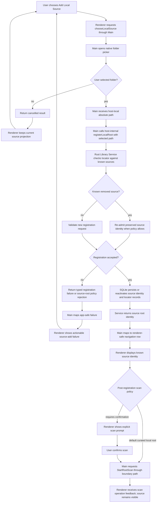

Governing law:

Renderer-callable APIs expose user intent, not host-local path authority. Absolute paths are host or service input only
after native picker selection or another trusted host-owned flow.

Implementation notes:

- A renderer API named chooseLocalSource may return a source identity or app-safe row, but must not return a host-local
  absolute path as general renderer authority.
- A host-internal registerLocalRoot call may carry the selected path from Main to the boundary client or service.
- Registration must check whether the selected locator corresponds to a removed source before creating a new durable
  source identity.
- `removed_by_user` means the source may retain metadata and may be re-admitted under the preserved source identity when
  the locator match and policy are valid.
- `forgotten` means durable records were purged by user request. Re-adding the same path after forgetting creates a new
  source identity unless a future explicit import/restore flow defines otherwise.
- First-slice product policy should request StartRootScan immediately after successful registration of a curated local
  root unless the registration result explicitly requires user confirmation.
- Future bulk import or migration flows must preserve the same ownership: host/service input first, renderer-safe
  identity after acceptance.

---

## 2. Source lifecycle and operation-state planes

Known sources remain visible unless explicitly removed or forgotten by the user. Registration state, visible source
state, and scan operation state are separate planes.

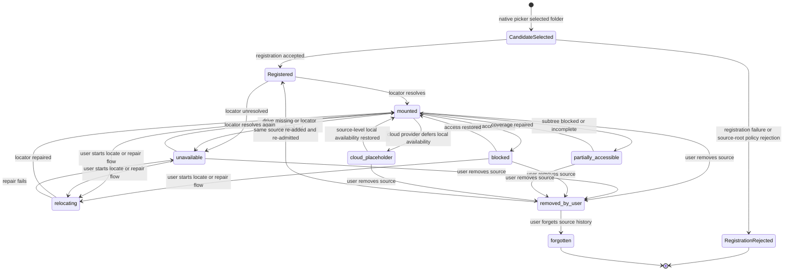

Scan operation overlay:

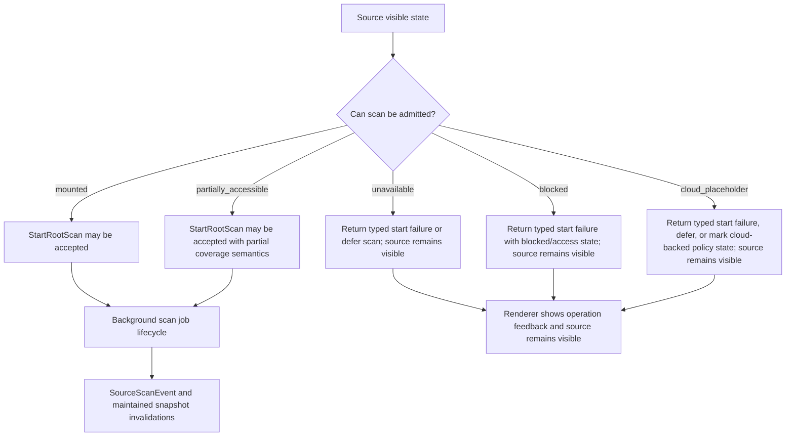

Governing law:

Missing, blocked, cloud-placeholder, and partially accessible sources are still known sources. They remain visible as
source state, not erased from navigation. Scan operation state is feedback, not source identity.

Partial coverage semantics:

When a scan runs under `partially_accessible`, the substrate may record successful coverage for accessible subtrees and
explicit incomplete or blocked coverage for inaccessible subtrees. Reads over affected scopes must distinguish available
rows, pending coverage, blocked coverage, and unknown coverage. Partial coverage never authorizes the renderer to erase
known source rows or convert the selected scope to empty.

Cloud note:

This document only names source-level `cloud_placeholder` as visible state. Per-file cloud download states such as
downloading, available, or download failed belong to content availability results and future row-level presentation
contracts. They are not expanded into a full source lifecycle here.

### Manual source access recovery

Manual retry is source recovery, not source re-add and not scan restart. Retrying source access does not automatically
run a scan unless source policy explicitly starts one after remount or repair. Source recovery restores access state;
scan operation remains a separate command and lifecycle.

Command names in this section are intended boundary operations. If the current schema does not define them,
implementation must add explicit service-owned commands or keep this section future/partial. Renderer-only retry is
forbidden.

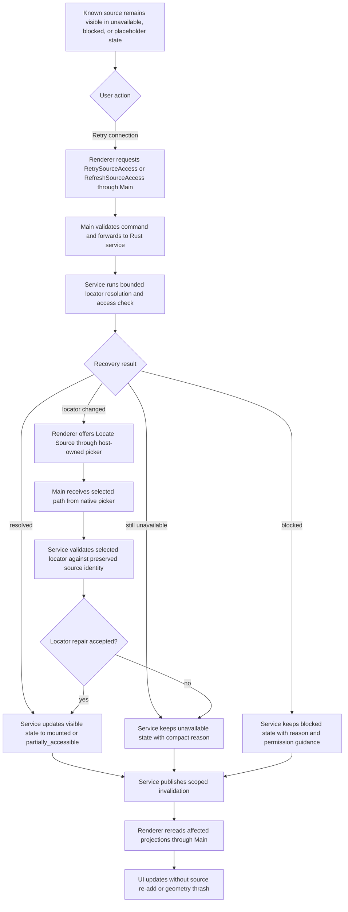

Recovery action policy:

| Source state              | Primary action                                            | Notes                                                                                    |
| ------------------------- | --------------------------------------------------------- | ---------------------------------------------------------------------------------------- |
| `unavailable`             | Retry connection                                          | For reseated drives, remounted volumes, or transient locator failures.                   |
| `unavailable` after retry | Locate source                                             | Uses a host-owned native picker; renderer never provides arbitrary path authority.       |
| `blocked`                 | Open permission guidance or retry after permission change | Deterministic permission denial is not micro-retried in a loop.                          |
| `cloud_placeholder`       | Make available locally or retry availability              | Cloud fetch does not belong to scan lifecycle unless a future OS integration defines it. |
| `removed_by_user`         | Re-add source                                             | Registration checks preserved identity before creating a new source.                     |
| `forgotten`               | Add as new source                                         | Durable substrate identity is gone.                                                      |

Remove versus forget cache behavior:

`removed_by_user` hides the source from the visible library but may preserve durable identity and history according to
policy. `forgotten` purges durable substrate records and invalidates all renderer caches for that source. These states
are not synonyms.

Governing law:

Known source stays visible, user retries or locates, service resolves, invalidation triggers reread, renderer updates.
The product must not turn source recovery into source disappearance followed by hopeful re-add. Source recovery is not
scan recovery unless source policy explicitly requests a scan after remount or repair.

---

## 3. Access failure, partial results, and empty contents

Empty contents is a valid result only when the selected scope is accessible and the authoritative contents read proves
there are no relevant rows.

Read stabilization policy:

- The service classifies transient source I/O instability before it admits terminal read failure.
- A bounded micro-retry policy may be used for filesystem or removable-media hiccups.
- The stabilization policy must have bounded attempts and a bounded time budget.
- Permission denial, source-root policy rejection, invalid request shape, schema mismatch, and deterministic access
  blocks are terminal classifications and are not retried as transient I/O.
- Renderer receives the classified result and preserves prior valid projection where the result requires degradation.
- Desktop Main and renderer do not implement filesystem retry policy; they broker and present classified service
  results.

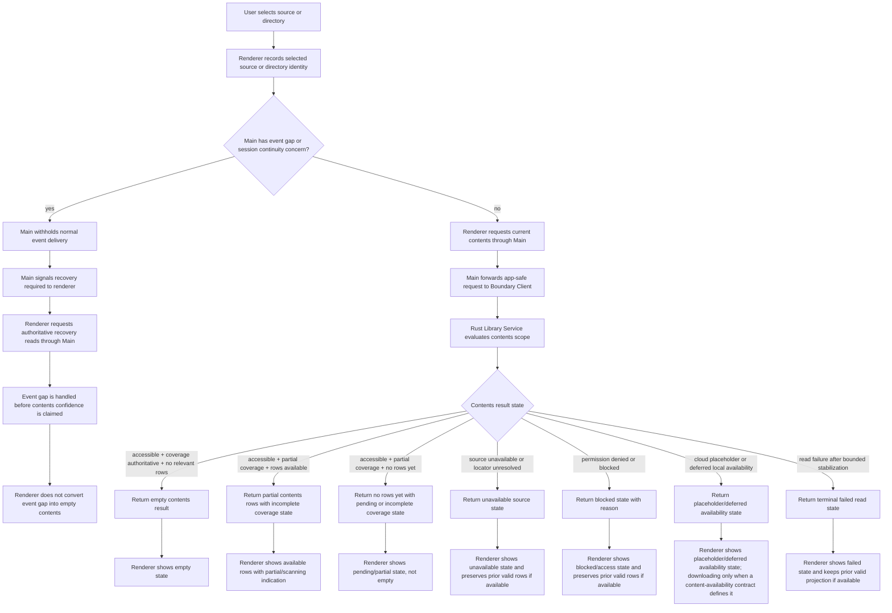

Governing law:

Access failure, missing source, blocked source, cloud-placeholder availability, pending coverage, partial coverage, and
read failure are not empty contents. Event gap is a Main-owned recovery precondition, not a contents result, and it also
must not become empty contents.

Implementation notes:

- The contents pane does not clear selection solely because a source becomes unavailable.
- A previous valid contents page may remain visible in degraded presentation while the current source state explains why
  it may be stale.
- A true empty state requires a successful authoritative contents read over an accessible and sufficiently covered
  scope.
- Partial scan UX must show discovered rows as they become available. A first-run scan over a large library must not
  appear frozen until completion.
- Cloud downloading presentation is shown only when a current content-availability contract defines it. Otherwise the
  renderer shows placeholder or deferred availability state.
- Degraded contents presentation must preserve scroll anchoring and structural geometry. Status detail belongs in stable
  row treatment, operation feedback, tooltip, or inspector surfaces, not inline expansion that shifts the contents pane.

---

## 4. Tree selection to contents scope flow

Tree expansion and contents selection are separate reads. The renderer never crawls the tree cache to answer
descendant-scope
contents.

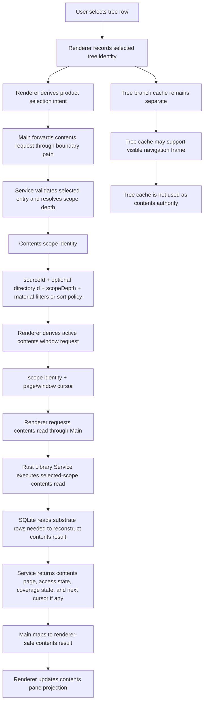

Pagination stub:

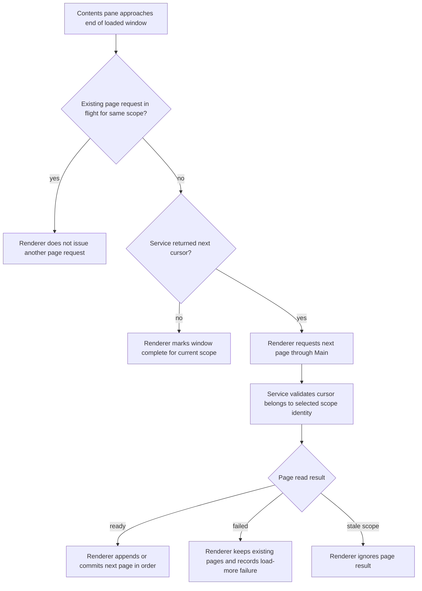

Governing law:

Tree expansion is immediate-children navigation. Contents selection is selected-scope projection. Renderer must not
synthesize contents rows from loaded tree branches.

Recursion policy:

The renderer may express product selection intent, but the service validates and resolves the effective scope depth
policy. First-slice default is descendant-scope contents for selected source and directory scopes, because the contents
pane
answers "what playable material is inside this selected library scope," not "which child nodes are currently expanded."
A future immediate-scope folder mode must be an explicit policy value, not an accidental side effect of tree expansion.

Pagination policy:

The page or window cursor is request-window state, not selected scope identity. Renderer may request the next page only
from a cursor returned by the service for the current selected scope. Renderer must not fan out all possible pages at
once.

---

## 5. Library tree branch cache lifecycle

Library tree branch cache is a renderer projection cache only. It stabilizes visible frames but does not own substrate
facts.

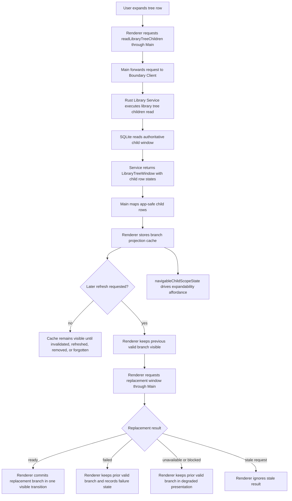

Governing law:

A failed, unavailable, blocked, or stale refresh must not erase a previously valid visible branch. Renderer branch cache
is a projection stability mechanism, not hierarchy authority.

Invalidation marks branch cache stale and schedules bounded refresh; it does not erase the visible branch by itself.

Conceptual `navigableChildScopeState` vocabulary:

These names are projection/product concepts. The current boundary schema defines
exactly three wire values: `unknown`, `hasNavigableChildScopes`, `noNavigableChildScopes`. The richer
states below are target scope expansion, not current wire values.

| State                   | Meaning                                                                                                        | Schema status                    |
| ----------------------- | -------------------------------------------------------------------------------------------------------------- | -------------------------------- |
| `has_children_unloaded` | The row can expand, but the child window is not loaded in the renderer cache.                                  | projection concept only          |
| `has_children_loaded`   | The row can expand and a current child window is loaded.                                                       | projection concept only          |
| `no_children`           | The authoritative read says the row has no navigable child scopes in this tree projection.                     | maps to `noNavigableChildScopes` |
| `scan_pending`          | Expandability or child scope completeness is not yet authoritative because coverage is incomplete.             | target scope expansion           |
| `unknown`               | The service cannot currently prove child scope state because of stale, unavailable, or failed read conditions. | maps to `unknown`                |

Implementation notes:

- Cache entries are keyed by stable source/directory identity plus window identity, not by mutable display labels.
- A branch cache may preserve frame continuity, but all replacement data comes from a service read.
- Removal and forgetting are the explicit cache-clearing source states.
- “One visible transition” means the renderer must not pass through an empty branch frame between prior valid data and
  replacement data. If the renderer framework batches async state, this must be validated as a visible-frame invariant
  rather than assumed from implementation syntax.
- Degraded branch presentation must not change row height, indentation, scroll anchor, branch structural dimensions, or
  layout participation. Warning detail that does not fit the existing row footprint belongs outside structural tree
  geometry.

---

## 6. Maintained snapshot invalidation scope map

Invalidation scopes route targeted rereads. Unknown or broad invalidation refreshes active first-slice projections only.

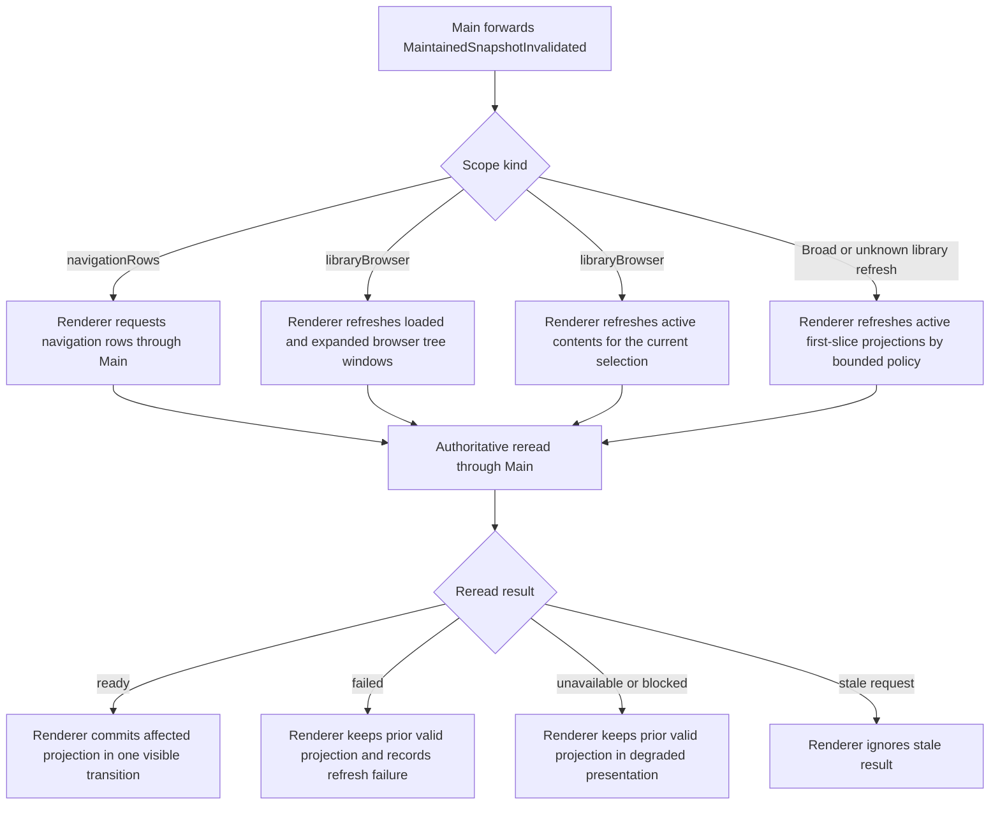

Governing law:

Snapshot invalidation carries boundary-defined scope identity. It does not carry replacement rows. Renderer uses
invalidation to request fresh authoritative snapshots through Main.

Current-schema `MaintainedSnapshotScope` values are `navigationRows` and `libraryBrowser`.

Desktop Main now pumps the service event stream and the renderer treats `MaintainedSnapshotInvalidated`
as normal refresh input. `navigationRows` refreshes navigation rows. `libraryBrowser` refreshes
previously loaded browser windows and expanded source/directory windows through authoritative reads,
keeping previous rows visible while those reads are pending.

The finer scopes shown in the invalidation diagrams (source visible state, library tree children by parent directory,
contents scope identity) are target scope expansion. They are not current wire values.

- If the schema does not define SourceLifecycle invalidation, do not name it as if it exists. Use the actual
  invalidation scope that causes source visible state to be reread.
- If the schema does not define ContentsScope boundaryScopeId, use contents scope identity. Do not key
  invalidation to a page or window cursor.
- Broad invalidation must not become a whole-app blind reload.

Broad invalidation policy:

A broad or unknown invalidation refreshes only the active first-slice projections required by the current library
surface:

1. Navigation rows.
2. Current contents window for the active contents scope.
3. Visible loaded tree windows in the current library viewport.

Active tree windows means the visible, pinned, or explicitly restored windows required for the current library surface
and first library substrate frame. It does not mean every cached or previously expanded branch.

Loaded but non-visible branch cache entries are marked stale and refreshed lazily when they become visible or are
interacted with. If a user has many expanded branches, broad invalidation must not trigger a waterfall reread of every
cached branch.

---

## 7. Renderer startup authoritative bootstrap

Startup is snapshot-first. Events are incremental only and are pumped by Main. Required startup reads should run in
parallel after Main prepares the event subscription cursor.

Active tree windows means the visible, pinned, or explicitly restored windows required for the current library surface
and first library substrate frame. It does not mean every cached or previously expanded branch. Non-visible cached
branches restore lazily.

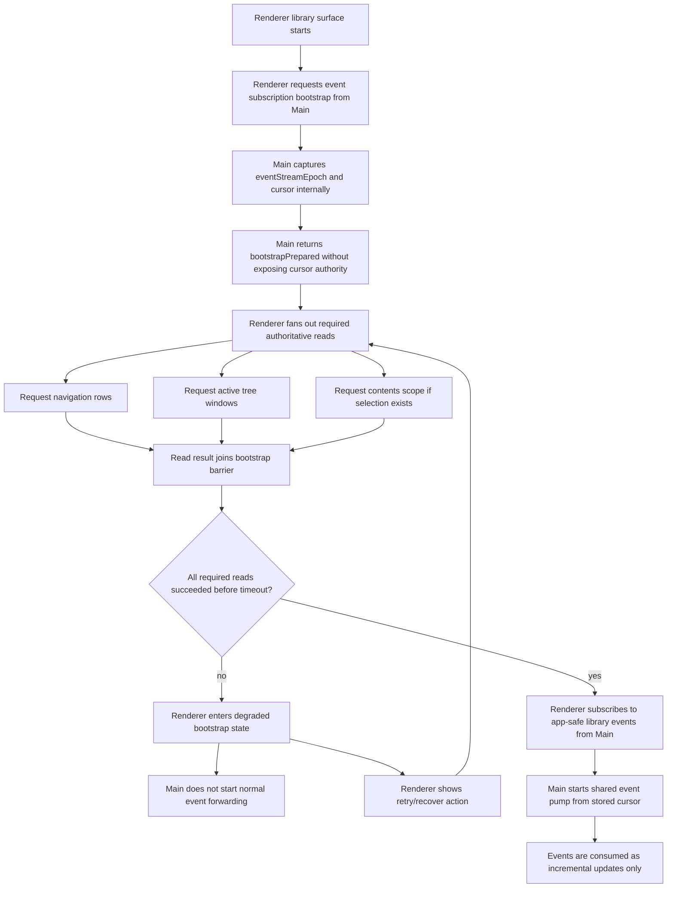

Governing law:

Event history is not startup state. Renderer startup rebuilds visible library projection from authoritative reads, then
consumes forwarded events for incremental change.

Acceptance bar:

- Main owns the event stream epoch and cursor.
- Renderer does not receive cursor authority.
- Required startup reads are fanned out after bootstrapPrepared. Navigation rows, active tree windows, and selected
  contents do not create an artificial serial dependency.
- Normal event forwarding starts only after required authoritative reads succeed.
- Failed or timed-out bootstrap produces degraded bootstrap state, not partial normal event delivery.
- Degraded bootstrap presents an explicit retry/recover action.
- Startup uses staged time-to-glass budgets. The shell frame and first library substrate frame are measured separately
  from full tree and contents restoration.
- Required first-frame performance budgets must be fixture-controlled, for example through
  `LIBRARY_BOOTSTRAP_TIME_TO_GLASS_BUDGET_MS`, and must report read timing breakdowns when they fail.

Timeout note:

A slow Rust service startup is allowed to delay successful bootstrap, but it must not silently produce an empty library
surface or block the app/workspace shell frame. A timeout moves the renderer to degraded bootstrap with retry, while
Main keeps normal event forwarding withheld.

---

## 8. Event subscription teardown

A library surface can unmount, hide, or be replaced. Event subscription ownership must unwind explicitly so stale
invalidations do not target a dead renderer surface.

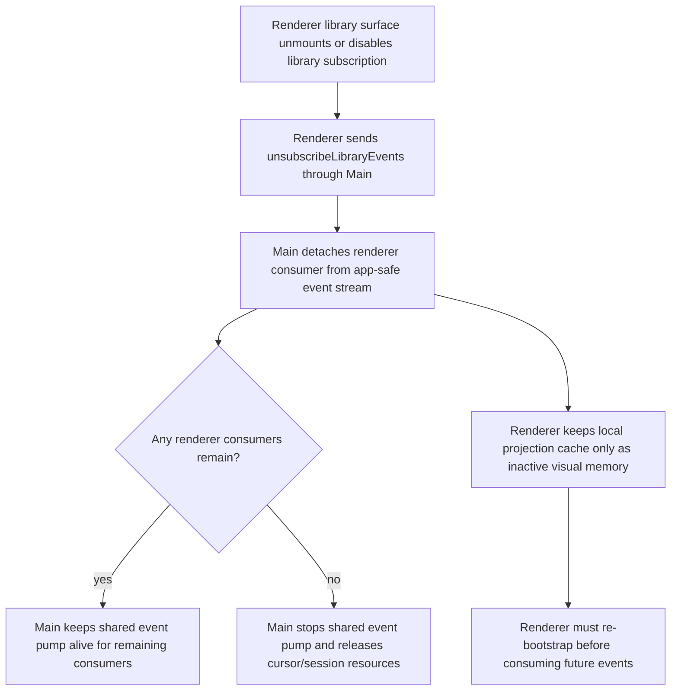

Governing law:

Event subscription lifetime is explicit. Renderer caches may survive as inactive visual memory, but a remounted library
surface must re-bootstrap before consuming new app-safe events. Stopping the Main event pump because no renderer
subscribers remain does not cancel active scan jobs and does not stop Rust-side event publication. A future subscriber
must re-bootstrap from authoritative reads and a fresh Main-owned cursor.

Implementation notes:

- Main owns pump lifecycle, cursor continuity, and event gap detection.
- Unsubscribe does not delete durable substrate state and does not clear renderer branch cache by itself.
- A stale consumer must not receive invalidations after teardown.

---

## 9. E2E reopen proof flow

The reopen proof demonstrates local durable ownership. Renderer projection is rebuilt from Rust/SQLite reads, not from
event replay or remembered renderer cache.

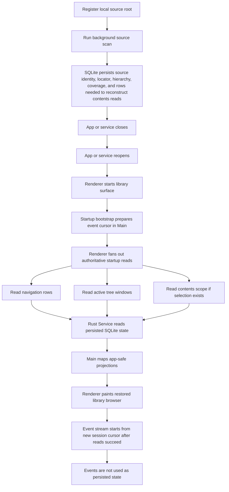

Governing law:

Reopen proof passes only when visible library state is restored from persisted Rust/SQLite substrate reads. Renderer
cache and session events are not durable library authority.

Reopen proof is progressive. It proves first library substrate frame restoration within a fixture-controlled budget,
then progressive restoration of active tree windows and current contents. It must not require a full library traversal,
scan completion, or event replay before first paint.

Reopen event law:

Events from the previous app session are not replayed as startup state. Any durable changes that occurred before close
or during service lifetime are recovered through SQLite reads. A new event session begins only after the snapshot-first
bootstrap succeeds, and subsequent events are incremental change signals.

Minimum test shape:

1. Create a source fixture with nested directories and media-relevant files.
2. Register the local source root.
3. Run the background root scan to completion.
4. Assert persisted navigation, hierarchy, coverage, and rows needed to reconstruct contents reads before
   close.
5. Close the service or app process.
6. Reopen against the same SQLite store.
7. Before any event replay is used as state, read navigation rows, at least one tree window, and a contents
   page through the same startup law used by the renderer.
8. Assert fixture-controlled time-to-glass for the first library substrate frame, measured from renderer library surface
   start to first painted source/navigation projection, using `LIBRARY_BOOTSTRAP_TIME_TO_GLASS_BUDGET_MS` or the
   repository's equivalent test budget.
9. Assert the timing report separates shell paint, navigation/source rows, tree window read, contents read, and
   progressive restoration work.
10. Assert stable source identity, stable directory identity where expected, restored hierarchy, and restored contents.
11. Assert renderer cache is not required to pass.
12. Assert a new event session cursor can start after snapshot reads.

---

## 10. Source root admission preflight sketch

This section is current-direction architecture, not a claim that full admission exists already.

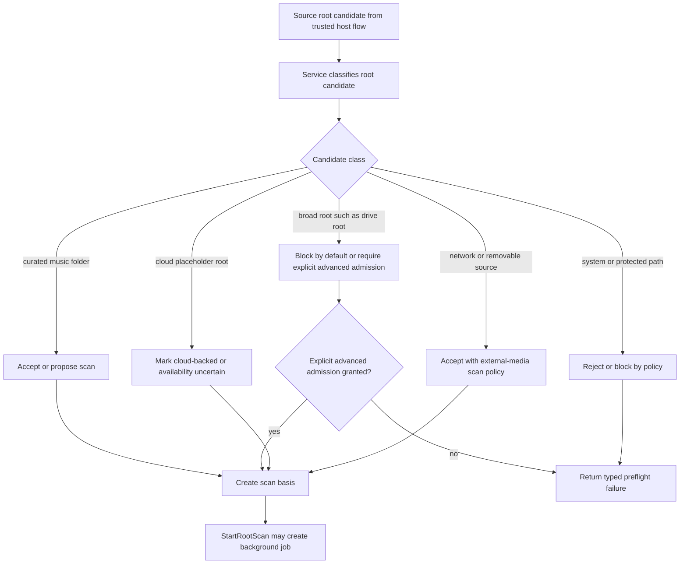

Governing law:

Scan admission is policy-governed source classification, not blind traversal over every byte reachable from a path.

Broad root policy:

Broad roots such as drive roots, volume roots, home roots, or operating-system roots are blocked by default. Future
explicit advanced admission must be a deliberate, multi-step user acknowledgement with a policy result the service can
audit. It is not normal folder-picker success.

Canon warning:

Until admission preflight is actually implemented and named in the boundary schema, this diagram must remain a sketch.
Do not cite it as current behavior in implementation docs without an implementation status note.

---

## 11. Library substrate authority map

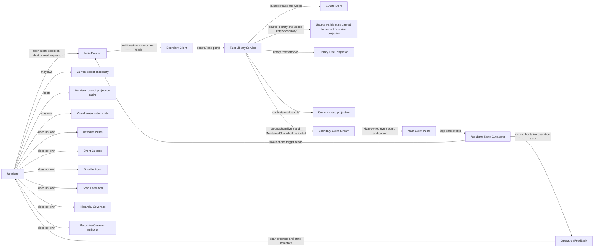

Governing law:

Renderer requests. Main brokers. Rust service decides. SQLite persists. Events announce movement. Reads recover state.

---

## 12. Ratification checklist

Before this sketch becomes canonical, verify each item against code and boundary schema:

1. Source visible-state names match the implemented schema or are explicitly documented as product vocabulary.
2. No diagram names a SourceLifecycle projection unless the schema defines one.
3. Contents invalidation uses contents scope identity, while active page/window cursors remain request-window
   identity only.
4. Startup bootstrap matches the background scan event recovery law: event forwarding starts only after authoritative
   reads succeed.
5. Startup reads are parallel after bootstrapPrepared, with one bootstrap barrier and a degraded retry path.
6. Event subscription teardown exists and prevents stale invalidation delivery.
7. Branch refresh failure preserves previous valid branch projection.
8. Invalidation-triggered reread failure preserves previous valid projection and records refresh failure.
9. Unavailable, blocked, cloud-placeholder, partial coverage, read failure, and event gap cannot render as empty
   contents.
10. Partial scan visibility shows available rows with incomplete coverage state rather than waiting for scan completion.
11. Re-adding a removed source checks preserved identity before creating a new source identity.
12. Broad invalidation policy is bounded and does not reread every cached branch.
13. Reopen proof exists at the service/store level before renderer integration claims durable restoration.
14. Startup and reopen tests enforce staged, fixture-controlled time-to-glass budgets without requiring full library
    sync before first paint.
15. Degraded presentation preserves row count, row height, indentation, scroll anchor, structural node dimensions, and
    layout participation.
16. Read failures are classified after bounded service-owned stabilization; Desktop Main and renderer do not implement
    filesystem retry policy.
17. Manual retry and locate flows recover known sources without requiring source disappearance or source re-add.
18. `navigableChildScopeState` values match the boundary schema, or this document marks them conceptual.
19. Manual retry, refresh, and locate operation names are implemented boundary commands or explicitly future/partial.
20. Read stabilization is service-owned, not Main-owned or renderer-owned.
21. Active tree windows are bounded to visible, pinned, or explicitly restored first-frame surfaces, not all cached
    branches.
22. Event subscription teardown does not cancel scans or stop Rust-side event publication.
23. Cloud downloading presentation is only used when a current content-availability contract defines it.
24. Source recovery does not imply scan restart unless source policy explicitly requests a scan.
25. `removed_by_user` and `forgotten` have distinct durable and cache behavior.
26. Source root admission preflight remains marked future/partial until implemented.
27. All Mermaid diagrams render.
28. No section leaks row-profile future work, deck runtime, column browser behavior, scheduler design,
    media-classification policy, waveform/resource handles, or preparation facets into this first-slice substrate
    contract.

## Stop rule

This document is allowed to sharpen the current library substrate. It is not allowed to become the home for every future
library idea. If a new diagram requires new durable objects, new renderer surfaces, or new product domains outside the
first-slice substrate, write a separate contract.
